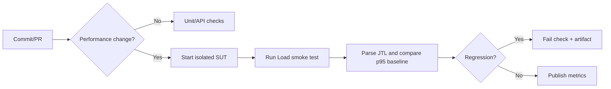

# Performance test report

This report is generated from the three JMeter runs in `../results/`. The SUT is the unmodified `eshop-sut` Node.js/Express API on `localhost:3000`; no files from `src/` are used.

## Scope

Admin workflow: `POST /api/login` → `GET /api/admin/users` → `GET /api/products` → `GET /api/categories` → product cleanup is exercised in Load (the transactional sampler is omitted from Stress/Spike to avoid uncontrolled write volume).

| Scenario | Users | Ramp-up | Loops | Timer | Listener |
|---|---:|---:|---:|---|---|
| Load | 10 | 10s | 5 | Gaussian 2s ± 0.333s | Aggregate Report |
| Stress | 50 | 15s | 10 | Gaussian 1s ± 0.167s | Summary Report |
| Spike | 100 | 1s | 3 | None | View Results Tree |

Run `../scripts/analyze_jtl.py` after execution to produce verified metrics. This demo does not claim an endurance threshold because no 10–15 minute soak run was requested or performed.

## Findings to verify

The SUT source shows admin routes authenticate a JWT but do not enforce `role === 'admin'`; this is a functional/security issue, not a performance result. Login failure increments `login_attempts` by 2 and locks for 180 seconds, so use only the seeded valid credential and restart/reset the demo database before reruns if needed.

## CI proposal

