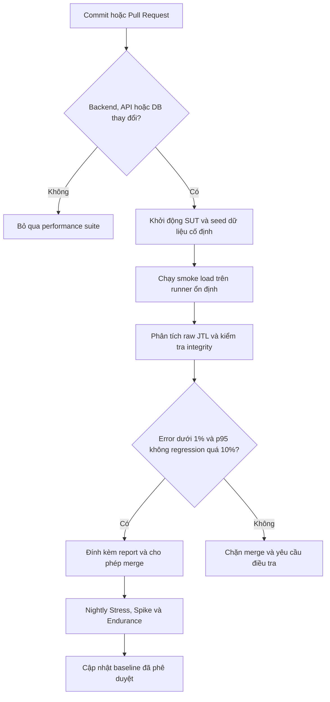

# Báo cáo kiểm thử hiệu năng HW05

- **Sinh viên**: Lê Trung Kiên - 23127075
- **Vai trò**: Thành viên 4, Admin Workflow
- **SUT**: EShop REST backend, Node.js và SQLite
- **Ngày chạy chính thức**: 2026-09-03 (Asia/Ho_Chi_Minh)

## 1. Task 1 - Thiết kế và thực thi

### 1.1. Workflow và dữ liệu

Cả ba test plan bắt buộc dùng cùng workflow sáu bước:

1. **Auth-heavy**: `POST /api/login`, trích xuất JWT.
2. **Read-heavy**: `GET /api/admin/users`, `GET /api/products`, `GET /api/categories`.
3. **Transactional**: `POST /api/products`, trích xuất ID, rồi `DELETE /api/products/:id` để dọn dữ liệu.

`data/credentials.csv` và `data/products.csv` tham số hóa credentials và payload sản phẩm. Tất cả đường dẫn trong JMX là tương đối từ `src/`. Mỗi sampler có assertion mã phản hồi; login và create-product có thêm assertion nội dung/extractor.

### 1.2. Human review và sửa test plan do AI sinh

AI ban đầu mô tả Gaussian timer là khoảng chặn cứng và đặt `${created_product_id}` trong tên sampler Delete. Gaussian Random Timer thực tế nhận mean/offset và standard deviation; biến trong label còn làm HTML report tách một transaction cho mỗi ID. Sau rà soát:

- Load dùng mean 2.000 ms, sigma 333 ms; xấp xỉ 99,7% giá trị nằm trong 1-3 giây.
- Stress dùng mean 1.000 ms, sigma 167 ms; xấp xỉ 99,7% giá trị nằm trong 0,5-1,5 giây.
- Spike không có think-time.
- ID động chỉ còn trong request path; sampler label ổn định.
- Runner xóa cả JTL và HTML cũ trước khi chạy. Validator đối chiếu số mẫu dự kiến với `statistics.json` để ngăn dữ liệu bị nối giữa các run.

### 1.3. Môi trường thực thi

| Thành phần | Thông số |
| --- | --- |
| Hostname | `tkin@fedora` |
| Máy | ASUS EXPERTBOOK B5404CMA |
| OS / Kernel | Fedora Linux 44 x86_64 / Linux 7.1.8-200.fc44.x86_64 |
| CPU | Intel Core Ultra 7 155H (6P + 8E + 2LPE), tối đa 3,80 GHz theo fastfetch |
| RAM / Swap | 14,92 GiB / 8,00 GiB |
| GPU | Intel Arc Graphics tích hợp |
| JMeter | Apache JMeter 5.6.3, non-GUI mode |
| Backend | Node.js, SQLite, `http://localhost:3000` |

Bằng chứng phần cứng: [`evidence/hardware/fastfetch.png`](../evidence/hardware/fastfetch.png).

### 1.4. Kết quả chính thức

Các chỉ số thời gian dưới đây tính từ cột JTL `elapsed` (request đến khi nhận đủ response). `Avg Latency` lấy riêng từ cột `Latency`; throughput là trung bình toàn run, không phải giá trị đỉnh theo time bucket.

| Metric | Load | Stress | Spike |
| --- | ---: | ---: | ---: |
| Threads / ramp-up / loops | 10 / 10 s / 5 | 50 / 15 s / 10 | 100 / 1 s / 3 |
| Samples | 300 | 3.000 | 1.800 |
| Duration | 66,914 s | 74,641 s | 5,103 s |
| Throughput trung bình | 4,4834 RPS | 40,1924 RPS | 352,7337 RPS |
| Avg response time (`elapsed`) | 9,76 ms | 7,62 ms | 238,47 ms |
| Avg JTL `Latency` | 9,46 ms | 7,44 ms | 238,31 ms |
| Min / Max response time | 3 / 61 ms | 1 / 62 ms | 4 / 569 ms |
| p95 / p99 response time | 17 / 42 ms | 15 / 20 ms | 476 / 532 ms |
| Errors | 0 (0,00%) | 0 (0,00%) | 0 (0,00%) |
| Listener | Aggregate Report | Summary Report | View Results Tree |

Nguồn dữ liệu và report:

| Scenario | Raw JTL | HTML report | Resource screenshot |
| --- | --- | --- | --- |
| Load | [`results/load/raw.jtl`](../results/load/raw.jtl) | [`results/load/html-report/index.html`](../results/load/html-report/index.html) | [`htop_load.png`](../evidence/screenshots/htop_load.png) |
| Stress | [`results/stress/raw.jtl`](../results/stress/raw.jtl) | [`results/stress/html-report/index.html`](../results/stress/html-report/index.html) | [`htop_stress.png`](../evidence/screenshots/htop_stress.png) |
| Spike | [`results/spike/raw.jtl`](../results/spike/raw.jtl) | [`results/spike/html-report/index.html`](../results/spike/html-report/index.html) | [`htop_spike.png`](../evidence/screenshots/htop_spike.png) |

Load và Stress giữ response time thấp khi có think-time. Spike đạt throughput trung bình cao hơn nhưng p95 tăng đến 476 ms, cho thấy tail latency xấu đi rõ rệt dù error rate vẫn bằng 0%.

### 1.5. Endurance 10 phút và điểm tải bền vững

Endurance dùng 30 VU, ramp-up 30 giây, Gaussian think-time mean 1.000 ms, sigma 167 ms và scheduler 600 giây. Kết quả thực nghiệm:

| Metric | Endurance |
| --- | ---: |
| Samples / errors | 17.238 / 0 (0,00%) |
| Khoảng đo theo JTL | 598,517 s |
| Throughput duy trì trung bình | 28,8012 RPS |
| Avg / p95 / p99 response time | 15,46 / 16 / 55 ms |
| Min / Max response time | 1 / 4.663 ms |
| Backend RSS | 103,676-111,680 MiB |
| Thay đổi RSS mẫu cuối so với mẫu đầu | -6,594 MiB |
| Backend CPU từ `ps` | 0,9-1,5% (trung bình vòng đời tiến trình, không phải CPU tức thời) |

Trong 121 mẫu tài nguyên cách nhau 5 giây, RSS không tăng dần và không có request lỗi. Cấu hình này chứng minh một **điểm tải bền vững 28,80 RPS trong 10 phút, RSS không vượt 111,68 MiB**; nó không chứng minh đây là RPS bền vững tối đa vì chưa chạy nhiều bậc tải. Một outlier 4.663 ms xuất hiện gần phút thứ chín; vì p95 vẫn 16 ms nên chưa đủ bằng chứng kết luận rò rỉ hay suy giảm kéo dài.

Scheduler dừng năm thread sau Create và trước Delete, nên JTL có 2.864 Create so với 2.859 Delete. Năm sản phẩm test ID `9216-9220` đã được xác định theo đúng tên trong CSV và xóa qua API; mỗi request trả `Product deleted`. Bằng chứng cleanup có cấu trúc nằm tại [`cleanup-evidence.json`](../results/endurance/cleanup-evidence.json).

Artifact: [`raw.jtl`](../results/endurance/raw.jtl), [`HTML report`](../results/endurance/html-report/index.html), [`backend-resources.csv`](../results/endurance/backend-resources.csv).

### 1.6. Account lockout và bug thật

Credentials đúng không kích hoạt lockout. Nếu dữ liệu login sai, reset trước run kế tiếp từ root repository:

```bash
sqlite3 eshop-sut/backend/database.sqlite \
  "UPDATE users SET login_attempts = 0, locked_until = NULL WHERE email = 'admin@eshop.com';"
```

Code review và phép thử không JWT xác nhận Product create/update/delete thiếu `authenticateToken`. `POST /api/products` không Authorization vẫn trả HTTP 200 và tạo ID 8943; probe đã được xóa sau kiểm tra. Chi tiết tại [`report/bug-report.md`](bug-report.md). GitHub Issue và screenshot chưa thể tạo do token `gh` hiện không hợp lệ.

Video YouTube unlisted tối thiểu 6 phút chưa được bổ sung; đây là thao tác thủ công còn chặn trạng thái sẵn sàng nộp.

## 2. Task 2 - AI analysis và misinterpretation hunt

### 2.1. Hai diễn giải sai được đối chiếu raw log

**Sai 1 - dùng average để đại diện tail latency.** AI từng kết luận hệ thống phản hồi khoảng 10 ms trên mọi người dùng. Raw Spike JTL cho thấy average `elapsed` là 238,47 ms nhưng p95 là 476 ms, p99 là 532 ms và max là 569 ms. Average không mô tả 5% request chậm nhất.

**Sai 2 - gọi throughput toàn run là throughput đỉnh.** AI từng gọi 338,2 RPS là “peak throughput”. Run chính thức cho 352,7337 RPS, nhưng đây là `samples / duration`, tức throughput trung bình trong 5,103 giây. Không có phép gom time bucket nên không thể khẳng định peak RPS từ số này.

**Phân biệt bổ sung - response time và latency.** JTL Spike có average `elapsed` 238,47 ms và average `Latency` 238,31 ms. Hai giá trị gần nhau trong run này nhưng không đồng nghĩa: `elapsed` đo toàn bộ response, còn `Latency` kết thúc khi byte phản hồi đầu tiên đến.

### 2.2. Đánh giá khuyến nghị tối ưu

| Khuyến nghị AI | Phân loại | Đánh giá sau rà soát |
| --- | --- | --- |
| Thêm index `users(email)` | Khả thi | Login truy vấn theo email và schema hiện không có index; nên cân nhắc unique index sau khi kiểm tra dữ liệu trùng. |
| Thêm index `products(id)` | Không cần thiết | `id INTEGER PRIMARY KEY AUTOINCREMENT` đã dùng index/rowid của SQLite; index thứ hai là dư thừa. |
| Bật SQLite WAL | Khả thi có điều kiện | Có thể cải thiện đồng thời đọc/ghi, nhưng phải benchmark lại và xem xét durability/checkpoint. |
| Dựng Redis cluster và Nginx load balancer | Ảo giác / ngoài phạm vi | SUT là một Node.js process với một file SQLite; đề xuất không giải quyết write contention hiện tại và thay đổi kiến trúc quá lớn. |

## 3. Task 3 - Continuous Performance Testing



- **Chi phí và tốc độ phản hồi**: PR chỉ chạy smoke load ngắn; Stress, Spike và Endurance chạy nightly để không kéo dài mỗi merge.
- **Độ nhiễu hạ tầng**: Shared runner làm percentile dao động. Nên pin cấu hình runner, chạy lặp lại và chỉ so với baseline cùng loại máy.
- **False positive**: Dùng tolerance 10%, yêu cầu lỗi lặp lại trước khi đổi baseline và giữ raw JTL để điều tra.
- **Tính toàn vẹn**: Pipeline phải fail khi sample count sai, JTL không khớp HTML, assertion lỗi hoặc output cũ chưa được dọn.

## 4. Kết luận

Bốn run thực tế đều hoàn tất với 0 lỗi HTTP/assertion. Stress đạt 40,19 RPS với p95 15 ms; Spike làm p95 tăng lên 476 ms. Endurance chứng minh 30 VU duy trì trung bình 28,80 RPS trong 10 phút với RSS tối đa 111,68 MiB, nhưng không xác lập tải tối đa và outlier 4,663 giây cần được theo dõi ở các run dài hơn. Các số liệu được sinh bởi `tools/analyze_jtl.py` và kiểm tra chéo với HTML `statistics.json`, không lấy từ ước lượng AI.
