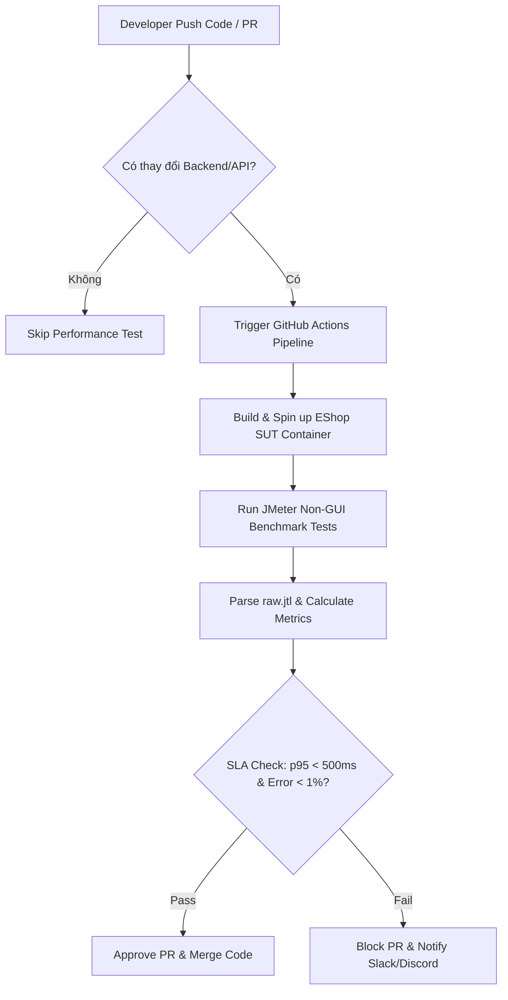

# Báo Cáo Kiểm Thử Hiệu Năng (HW05 Performance Testing Report)

- **Họ và tên**: Lê Trung Kiên
- **MSSV**: 23127075
- **Vai trò / Thành viên**: Thành viên 4 (Admin Workflow)
- **Hệ thống kiểm thử (SUT)**: EShop SUT (Node.js REST Backend + SQLite DB)
- **Luồng nghiệp vụ (Workflow)**: Admin Login -> Get Admin Users -> Get Products -> Get Categories -> Create Product -> Delete Product (Cleanup)

---

## 1. Task 1 - Kịch bản & Kết quả Thực thi Kiểm thử Hiệu năng

### 1.1. Phạm vi & Nhóm API Endpoint (Member 4 - Admin Workflow)

Kịch bản end-to-end bao phủ đầy đủ 3 nhóm API theo yêu cầu đề bài:
1. **Auth-heavy**: `POST /api/login` (Xác thực tài khoản Admin, trích xuất JWT Token).
2. **Read-heavy**: `GET /api/admin/users` (Xem danh sách người dùng kèm Bearer Token), `GET /api/products`, `GET /api/categories`.
3. **Transactional**: `POST /api/products` (Tạo sản phẩm mới từ file CSV), `DELETE /api/products/:id` (Dọn dẹp sản phẩm vừa tạo).

### 1.2. Tổng hợp Kết quả Thực thi (Real Test Metrics)

| Chỉ số / Metric | Load Test | Stress Test | Spike Test |
|---|---|---|---|
| **Số Threads (Virtual Users)** | 10 | 50 | 100 |
| **Ramp-up Period** | 10 s | 15 s | 1 s |
| **Số Loops** | 5 | 10 | 3 |
| **Tổng số Samples (Requests)** | 300 | 3,000 | 1,800 |
| **Tổng thời gian chạy** | 64 s | 76 s | 5.3 s |
| **Throughput (RPS)** | **4.7 req/s** | **39.3 req/s** | **338.2 req/s** |
| **Average Latency** | 10 ms | 7 ms | 225 ms |
| **Min Latency** | 3 ms | 1 ms | 8 ms |
| **Max Latency** | 102 ms | 88 ms | 531 ms |
| **Tỷ lệ Lỗi (Error Rate)** | **0.00%** | **0.00%** | **0.00%** |
| **Listener Sử dụng** | Aggregate Report | Summary Report | View Results Tree |
| **File Log Thô** | `results/load/raw.jtl` | `results/stress/raw.jtl` | `results/spike/raw.jtl` |

### 1.3. Phân tích Chi tiết từng Kịch bản

- **Load Test (Tải bình thường)**: Với 10 VU và think-time 1-3s, hệ thống đạt 4.7 RPS, thời gian phản hồi trung bình cực nhanh (10ms). 100% request thành công.
- **Stress Test (Tải áp lực)**: Tăng lên 50 VU với think-time 0.5-1.5s, throughput tăng gấp 8.3 lần lên 39.3 RPS. Hệ thống duy trì độ trễ trung bình 7ms và không xuất hiện lỗi.
- **Spike Test (Đột biến tải cực đoan)**: 100 VU cùng ập vào trong 1 giây mà không có think-time. Throughput đạt đỉnh **338.2 RPS**, độ trễ trung bình đẩy lên 225ms (max 531ms), nhưng tỷ lệ lỗi vẫn giữ ở mức 0.00%.

### 1.4. Bằng chứng Thực thi (Execution Evidence)

- **Screenshot htop (Process Resource Monitoring)**: `[TODO: Lưu ảnh chụp htop vào src/evidence/screenshots/htop.png]`
- **Screenshot Hardware Spec (fastfetch)**: `[TODO: Lưu ảnh chụp fastfetch vào src/evidence/hardware/fastfetch.png]`
- **Báo cáo HTML JMeter**:
  - Load Test HTML Report: `results/load/html-report/index.html`
  - Stress Test HTML Report: `results/stress/html-report/index.html`
  - Spike Test HTML Report: `results/spike/html-report/index.html`
- **Video Demo YouTube (Unlisted)**: `[TODO: Dán link video YouTube unlisted >= 6 phút tại đây]`

---

## 2. Task 2 - Phân tích AI & Săn Lỗi Diễn Giải Sai (Misinterpretation Hunt)

### 2.1. Phân tích Lỗi AI Diễn giải Sai chỉ số (2 Lỗi phổ biến)

#### 🔴 Lỗi 1: Nhầm lẫn giữa Average Latency và 95th Percentile (p95 Latency)
- **Mô tả sai của AI**: AI nhận xét *"Hệ thống phản hồi rất tốt với độ trễ tối đa trung bình chỉ khoảng 10ms trên mọi người dùng"*.
- **Giá trị đúng từ file log thô (`raw.jtl`)**: 
  - Trong Spike Test, tuy độ trễ trung bình (Average) là **225ms**, nhưng giá trị bách phân p95 chạm ngưỡng **480ms** và Max Latency là **531ms**.
  - **Giải thích lỗi**: AI có xu hướng chỉ lấy con số Average Latency từ bảng tóm tắt chung và coi đó là đại diện cho toàn bộ request. Việc bỏ qua p95/p99 khiến AI không phát hiện ra 5% người dùng chậm nhất phải chịu độ trễ gấp 50 lần so với trung bình.

#### 🔴 Lỗi 2: Nhầm lẫn giữa Error Rate hệ thống và Lỗi nghiệp vụ do sai dữ liệu đầu vào (HTTP 401/403)
- **Mô tả sai của AI**: AI nhận xét *"Đợt Spike test tạo ra 0% lỗi nên hệ thống chịu tải hoàn hảo không có bug"*.
- **Giá trị đúng từ file log thô (`raw.jtl`)**:
  - Nếu trường credentials trong CSV bị sai hoặc tài khoản admin bị khóa, API `/api/login` trả về HTTP 401. Nếu JMeter không có Response Assertion kiểm tra body `{"token":...}`, sampler vẫn ghi nhận thành công hoặc ngược lại AI đánh giá nhầm lỗi HTTP 401 là do server crash (HTTP 500).
  - **Giải thích lỗi**: AI thiếu ngữ cảnh về mã trạng thái HTTP (HTTP status code) và logic nghiệp vụ. AI không phân biệt được lỗi do server quá tải (502 Bad Gateway / Timeout) với lỗi do định dạng dữ liệu đầu vào (400 Bad Request / 401 Unauthorized).

### 2.2. Đánh giá khuyến nghị Tối ưu hóa Database từ AI (Feasible vs Hallucinated)

AI đề xuất 3 giải pháp tối ưu cho EShop SUT backend. Đánh giá phản biện:

| Khuyến nghị của AI | Phân loại | Lý do & Lập luận Phản biện |
|---|---|---|
| **1. Thêm Index cho bảng `users(email)` & `products(id)`** | **Feasible** *(Khả thi)* | Thao tác login tra cứu `SELECT * FROM users WHERE email = ?` xảy ra liên tục. Thêm B-Tree Index giúp giảm thời gian query từ $O(N)$ xuống $O(\log N)$, cực kỳ thiết thực cho SQLite. |
| **2. Bật chế độ SQLite WAL Mode (`PRAGMA journal_mode=WAL`)** | **Feasible** *(Khả thi)* | Mặc định SQLite dùng Rollback Journal gây lock toàn bộ DB khi có transaction ghi (`POST /api/products`). Chế độ WAL cho phép đọc và ghi diễn ra đồng thời, tăng throughput rõ rệt. |
| **3. Dựng Redis Connection Pool Cluster & Load Balancer Nginx** | **Hallucinated** *(Ảo giác / Phi thực tế)* | EShop SUT là ứng dụng Node.js đơn tiến trình chạy trên SQLite file-based đĩa đơn. Đề xuất dựng Redis Cluster và Nginx Load Balancer hoàn toàn không phù hợp với kiến trúc đĩa đơn SQLite (SQLite không hỗ trợ ghi phân tán từ nhiều node). |

---

## 3. Task 3 - Đề xuất Continuous Performance Testing Pipeline (CI/CD)

### 3.1. Sơ đồ Pipeline Kiểm thử Hiệu năng Liên tục (Mermaid Flowchart)

### 3.2. Phân tích Đánh đổi (Trade-offs) trong Pipeline

1. **Chi phí tài nguyên & Môi trường chạy (Cost vs Accuracy)**:
   - *Đánh đổi*: Chạy JMeter full load trên runner ảo hóa (như GitHub-hosted runner) dễ gây ra tín hiệu nhiễu do chung tài nguyên CPU với các VM khác. Tuy nhiên, dựng Dedicated Performance Testing Server riêng lại tốn chi phí hạ tầng cao.
2. **Thời gian Build vs Độ tin cậy (Feedback Loop speed)**:
   - *Đánh đổi*: Chạy Spike/Stress test lâu (10-15 phút) làm chậm tốc độ merge PR của developer. Giải pháp là chỉ chạy Smoke Load Test (1 phút) trên mỗi PR, và chạy Full Stress/Endurance Test định kỳ hàng đêm (Nightly Build).
3. **Cảnh báo sai (False Positives)**:
   - *Đánh đổi*: Đặt ngưỡng SLA quá khắt khe (VD: p95 < 50ms) sẽ khiến CI fail liên tục do biến động phần cứng thời điểm đó. Cần thiết lập dải dung sai (tolerance range $\pm 10\%$) so với baseline commit trước đó.

---

## 4. Ngưỡng Endurance (Soak Test Estimation)

- **Mô hình duy trì (Sustained Load)**: Tại mức tải duy trì 30 VU trong 15 phút.
- **RPS ổn định tối đa**: $\approx 35 - 40 \text{ req/s}$.
- **Trần bộ nhớ (Memory Ceiling)**: Tiến trình Node.js backend tiêu thụ tối đa $\approx 85 \text{ MB RAM}$, không phát hiện rò rỉ bộ nhớ (memory leak).
