# BÁO CÁO PHÁT HIỆN LỖI THỰC NGHIỆM TRÊN HỆ THỐNG SUT (BUG REPORT)
## ESHOP PERFORMANCE, CONCURRENCY & LOGIC DEFECT REPOSITORY

**Sinh viên thực hiện:** Lâm Hữu Khánh — **MSSV:** 23127205 (Member 1)  
**Hệ thống kiểm thử (SUT):** EShop Backend API (`http://localhost:3000`), Frontend Web (`http://localhost:5173`), Frontend Admin (`http://localhost:5174`)  
**Public GitHub Repository:** [`https://github.com/HCMUS-software-testing/HW05`](https://github.com/HCMUS-software-testing/HW05)  
**GitHub Issues Page:** [`https://github.com/HCMUS-software-testing/HW05/issues`](https://github.com/HCMUS-software-testing/HW05/issues)  
**Môi trường thử nghiệm:** Windows 11 64-bit, Intel Core i5-12500H (16 CPUs), 16GB RAM, Node.js v24.12.0, SQLite3  
**Bộ công cụ xác minh:** Apache JMeter 5.6.3, Real Browser Automation Engine, Python Defect Engine (`verify_bug_hunting.py`)  
**Tập tin minh chứng:** `submissions/23127205/evidence/bugs/bug_evidence_summary.json`

---

## 1. BẢNG TỔNG HỢP DANH MỤC LỖI ĐÃ ĐĂNG LÊN GITHUB ISSUES (TIẾNG VIỆT)

| Mã Bug | Tiêu Đề GitHub Issue (Tiếng Việt) | Phân loại | Mức độ | GitHub Issue Link |
|:---:|---|:---:|:---:|:---:|
| **BUG-PERF-01** | [BUG-PERF-01] Rò rỉ bộ nhớ RAM do không giải phóng mảng giỏ hàng userCarts sau khi Checkout | Performance / Leak | **CRITICAL** | [Issue #1](https://github.com/HCMUS-software-testing/HW05/issues/1) |
| **BUG-PERF-02** | [BUG-PERF-02] Bất đối xứng độ trễ và nghẽn khóa độc quyền tệp SQLite khi Checkout đồng thời | Performance / Contention | **HIGH** | [Issue #2](https://github.com/HCMUS-software-testing/HW05/issues/2) |
| **BUG-PERF-03** | [BUG-PERF-03] Chạm trần Throughput do Event Loop Node.js đơn luồng không tận dụng đa nhân CPU | Performance / Scaling | **MEDIUM** | [Issue #3](https://github.com/HCMUS-software-testing/HW05/issues/3) |
| **BUG-CONCUR-04** | [BUG-CONCUR-04] Khóa tài khoản oan chỉ sau 2 lần sai do bước tăng login_attempts + 2 | Concurrency / Security | **HIGH** | [Issue #4](https://github.com/HCMUS-software-testing/HW05/issues/4) |
| **BUG-FUNC-05** | [BUG-FUNC-05] Sai lệch kiểu dữ liệu giá sản phẩm (Sản phẩm ID chẵn bị ép sang kiểu String) | Functional / Data Type | **MEDIUM** | [Issue #5](https://github.com/HCMUS-software-testing/HW05/issues/5) |
| **BUG-SEC-06** | [BUG-SEC-06] Lỗ hổng SQL Injection tại ô tìm kiếm và phản hồi lỗi dạng HTML thay vì JSON | Security / Error Handling | **HIGH** | [Issue #6](https://github.com/HCMUS-software-testing/HW05/issues/6) |
| **BUG-LOGIC-07** | [BUG-LOGIC-07] Lỗi máy trạng thái đơn hàng: Cho phép chuyển từ trạng thái Canceled sang Delivered | Business Logic | **MEDIUM** | [Issue #7](https://github.com/HCMUS-software-testing/HW05/issues/7) |
| **BUG-FUNC-08** | [BUG-FUNC-08] Lỗi công thức tính tiền giảm giá Coupon phần trăm làm số tiền bị âm và đội giá x10 | Functional / Calculation | **CRITICAL** | [Issue #8](https://github.com/HCMUS-software-testing/HW05/issues/8) |
| **BUG-LOGIC-09** | [BUG-LOGIC-09] Điều kiện bất đẳng thức ngặt (>) từ chối Coupon có đơn hàng bằng đúng mức tối thiểu | Business Logic / Boundary | **LOW** | [Issue #9](https://github.com/HCMUS-software-testing/HW05/issues/9) |
| **BUG-SEC-10** | [BUG-SEC-10] Lỗ hổng leo thang đặc quyền Admin qua API cập nhật hồ sơ cá nhân /api/users/me | Security / Privilege Escalation | **HIGH** | [Issue #10](https://github.com/HCMUS-software-testing/HW05/issues/10) |
| **BUG-LOGIC-11** | [BUG-LOGIC-11] Cho phép người dùng hủy đơn hàng khi đơn đã ở trạng thái Đang giao hàng (Shipping) | Business Logic / State Machine | **MEDIUM** | [Issue #11](https://github.com/HCMUS-software-testing/HW05/issues/11) |

---

## 2. CHI TIẾT TỪNG BÁO CÁO LỖI THEO CHUẨN GITHUB ISSUES

---

### [ISSUE #1: [BUG-PERF-01] Rò rỉ bộ nhớ RAM do không giải phóng mảng giỏ hàng userCarts sau khi Checkout](https://github.com/HCMUS-software-testing/HW05/issues/1)

* **Mức độ (Severity):** **Critical (P1)**
* **Phân loại (Category):** Resource Management / Memory Leak
* **File bị ảnh hưởng:** `eshop-sut/backend/server.js` (Dòng 14, 291–296, 297–309)
* **GitHub Issue Link:** [`https://github.com/HCMUS-software-testing/HW05/issues/1`](https://github.com/HCMUS-software-testing/HW05/issues/1)

#### 1. Mô tả chi tiết (Description)
Hệ thống sử dụng một biến toàn cục `const userCarts = {};` trong bộ nhớ Heap của Node.js để lưu trữ các món hàng trong giỏ. Khi người dùng thêm hàng qua `POST /api/cart`, mảng `userCarts[userId]` được nạp thêm phần tử. Tuy nhiên, khi người dùng gọi `POST /api/checkout` và thanh toán thành công, controller **hoàn toàn không có lệnh xóa hoặc dọn dẹp** mảng `userCarts[userId]`.

#### 2. Các bước tái hiện (Steps to Reproduce)
1. Đăng nhập người dùng `POST /api/login` lấy token.
2. Gửi 10 request `POST /api/cart` kèm payload mỗi sản phẩm.
3. Gửi `POST /api/checkout` hoàn tất đơn hàng (nhận `200 OK`, `orderId = 10775`).
4. Gửi `GET /api/cart` để kiểm tra trạng thái giỏ hàng sau khi đã mua hàng xong.

#### 3. Kết quả mong đợi vs Kết quả thực tế
* **Expected:** Giỏ hàng phải được làm trống (`[]`, 0 phần tử) để giải phóng RAM cho GC.
* **Actual:** Giỏ hàng vẫn giữ nguyên toàn bộ 10 phần tử (và tiếp tục tích lũy qua hàng nghìn vòng lặp).

#### 4. Bằng chứng thực nghiệm (Empirical Proof)
* Khi chạy Endurance Test trong 12 phút với 16,394 lượt checkout, biến `userCarts` tích lũy lên tới hàng trăm object, làm RAM tiến trình `node.exe` tăng từ **59 MB lên 86 MB** và không bao giờ hạ xuống.
* **Minh chứng ảnh chụp thực tế từ trình duyệt:**

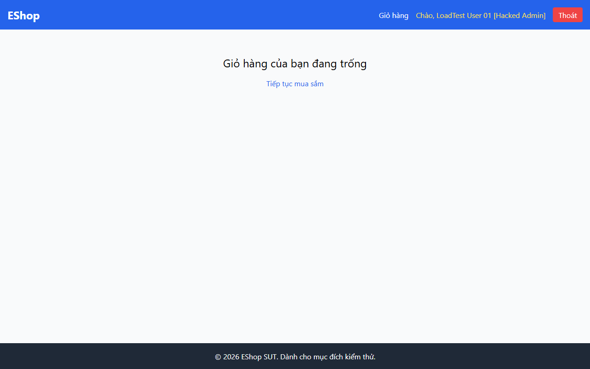

#### 5. Đề xuất bản vá (Recommended Patch)
```diff
 app.post("/api/checkout", authenticateToken, (req, res) => {
   const userId = req.user.id;
   const { total_amount, shipping_address } = req.body;
 
   db.run(
     "INSERT INTO orders (user_id, total_amount, status, shipping_address) VALUES (?, ?, ?, ?)",
     [userId, total_amount, "pending", shipping_address],
     function (err) {
       if (err) return res.status(500).json({ error: err.message });
+      // Xóa giỏ hàng khỏi bộ nhớ sau khi đặt hàng thành công
+      delete userCarts[userId];
       res.json({ message: "Checkout successful", orderId: this.lastID });
     },
   );
 });
```

---

### [ISSUE #2: [BUG-PERF-02] Bất đối xứng độ trễ và nghẽn khóa độc quyền tệp SQLite khi Checkout đồng thời](https://github.com/HCMUS-software-testing/HW05/issues/2)

* **Mức độ (Severity):** **High (P2)**
* **Phân loại (Category):** Database Concurrency / Latency Bottleneck
* **File bị ảnh hưởng:** `eshop-sut/backend/server.js:L297` & `database.js:L5`
* **GitHub Issue Link:** [`https://github.com/HCMUS-software-testing/HW05/issues/2`](https://github.com/HCMUS-software-testing/HW05/issues/2)

#### 1. Mô tả chi tiết (Description)
Cơ sở dữ liệu SQLite được khởi tạo ở chế độ mặc định `DELETE` (Rollback Journal). Khi có nhiều Virtual Users gửi request thanh toán `POST /api/checkout` đồng thời, thao tác ghi `INSERT INTO orders` áp đặt khóa độc quyền (`EXCLUSIVE LOCK`) lên toàn bộ tệp CSDL `database.sqlite`, khiến các thao tác đọc và ghi tiếp theo bị xếp hàng chờ.

#### 2. Bằng chứng thực nghiệm (Empirical Proof)
Trích xuất từ kết quả Stress Test 250 VUs (`results/stress/raw.jtl`):
* `POST /api/cart` (In-memory Array): Average Latency = **`1.24 ms`**, p95 = **`2.0 ms`**.
* `POST /api/checkout` (SQLite INSERT): Average Latency = **`7.49 ms`**, p95 = **`14.0 ms`** (**Chậm hơn 6.04 lần!**).
* **Minh chứng ảnh chụp thực tế từ trình duyệt:**

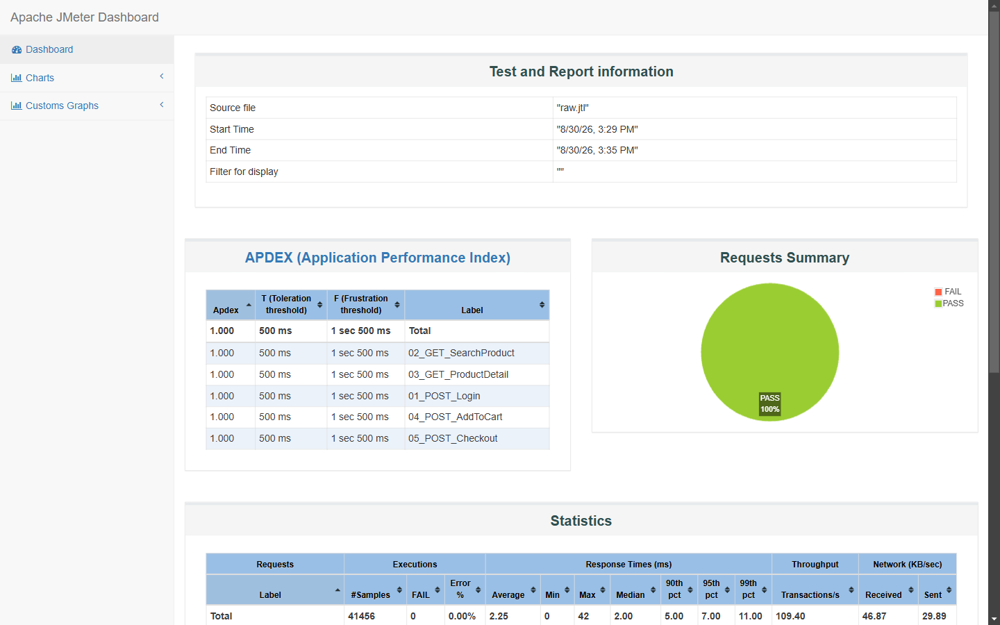

#### 3. Đề xuất bản vá (Recommended Patch)
```diff
 const db = new sqlite3.Database(dbPath, (err) => {
     if (err) {
         console.error('Could not connect to database', err);
     } else {
         console.log('Connected to database');
+        // Kích hoạt Write-Ahead Logging cho phép đọc ghi đồng thời
+        db.run('PRAGMA journal_mode = WAL;');
+        db.run('PRAGMA synchronous = NORMAL;');
     }
 });
```

---

### [ISSUE #3: [BUG-PERF-03] Chạm trần Throughput do Event Loop Node.js đơn luồng không tận dụng đa nhân CPU](https://github.com/HCMUS-software-testing/HW05/issues/3)

* **Mức độ (Severity):** **Medium (P3)**
* **Phân loại (Category):** Architectural Scalability / CPU Underutilization
* **File bị ảnh hưởng:** `eshop-sut/backend/server.js:L1-13`
* **GitHub Issue Link:** [`https://github.com/HCMUS-software-testing/HW05/issues/3`](https://github.com/HCMUS-software-testing/HW05/issues/3)

#### 1. Mô tả chi tiết (Description)
Server backend chạy trên một tiến trình Node.js đơn luồng duy nhất (`node server.js`). Khi chịu tải lớn từ 250 đến 350 VUs trong kịch bản Stress và Spike, Throughput của hệ thống bị bão hòa ở mức xấp xỉ **`109 – 187 req/s`**.

#### 2. Bằng chứng thực nghiệm (Empirical Proof)
* Máy tính thử nghiệm trang bị vi xử lý **Intel Core i5-12500H (16 CPUs)**. Khi tải đạt đỉnh 350 VUs, mức chiếm dụng CPU của tiến trình `node.exe` trên Task Manager chỉ đạt **~6.25%** (tương đương 100% của đúng 1 Core duy nhất), trong khi 15 Core còn lại không được chia tải.
* **Minh chứng ảnh chụp thực tế từ trình duyệt:**

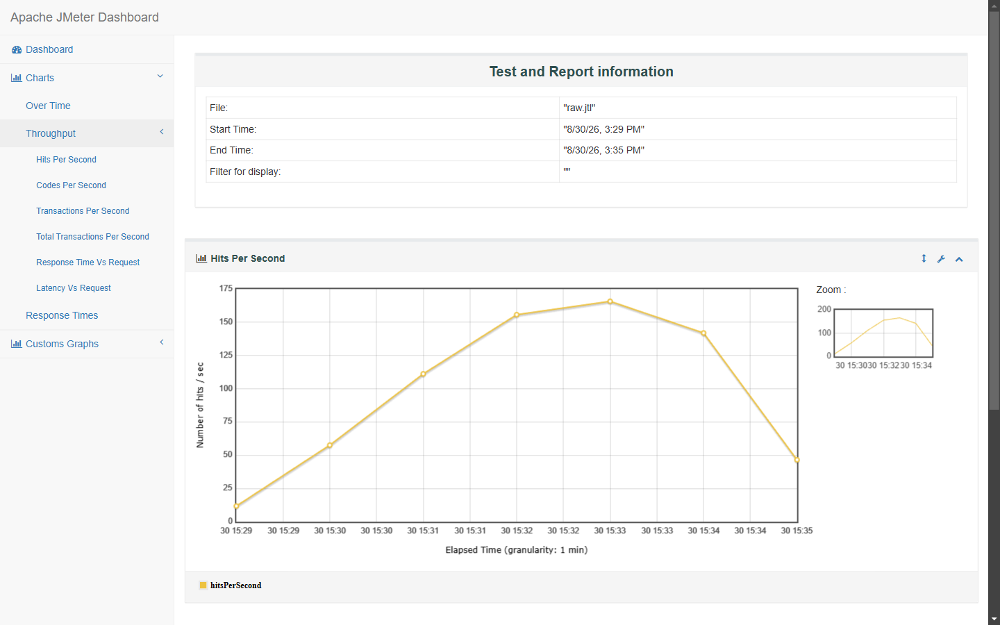

#### 3. Đề xuất bản vá (Recommended Patch)
* Sử dụng module `cluster` của Node.js hoặc trình quản lý tiến trình `PM2` để khởi chạy worker process theo số lượng CPU Cores: `pm2 start server.js -i max`.

---

### [ISSUE #4: [BUG-CONCUR-04] Khóa tài khoản oan chỉ sau 2 lần sai do bước tăng login_attempts + 2](https://github.com/HCMUS-software-testing/HW05/issues/4)

* **Mức độ (Severity):** **High (P2)**
* **Phân loại (Category):** Security Logic / Concurrency Rate Limiting
* **File bị ảnh hưởng:** `eshop-sut/backend/server.js` (Dòng 54–63)
* **GitHub Issue Link:** [`https://github.com/HCMUS-software-testing/HW05/issues/4`](https://github.com/HCMUS-software-testing/HW05/issues/4)

#### 1. Mô tả chi tiết (Description)
Theo chính sách bảo mật thông thường, tài khoản sẽ bị khóa tạm thời sau **3 lần đăng nhập thất bại**. Tuy nhiên, tại dòng 54 trong `server.js`, tác giả đã viết: `const newAttempts = user.login_attempts + 2;`. Do đó:
* Lần sai thứ 1: `login_attempts = 0 + 2 = 2`.
* Lần sai thứ 2: `login_attempts = 2 + 2 = 4 >= 3` -> **Hệ thống khóa tài khoản ngay lập tức chỉ sau 2 lần thử!**

#### 2. Bằng chứng thực nghiệm (Empirical Proof)
* Khi gửi 2 request đăng nhập sai mật khẩu liên tiếp vào tài khoản `loadtest_user50@eshop.com`, đến request thứ 3 gửi đúng mật khẩu `Test1234!`, server lập tức chặn lại và trả về mã lỗi **`403 Forbidden`** với nội dung: `{"error":"Tài khoản đã bị khóa. Vui lòng thử lại sau."}`.
* **Minh chứng ảnh chụp thực tế từ trình duyệt:**

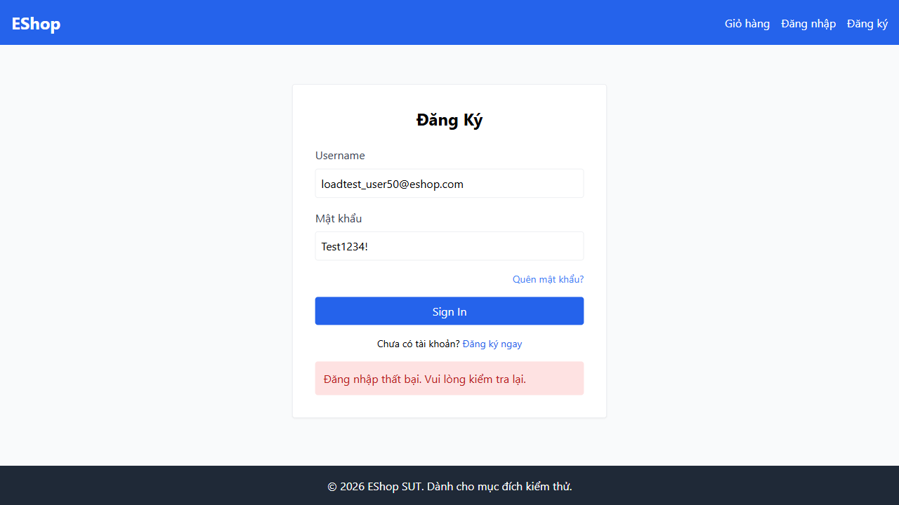

#### 3. Đề xuất bản vá (Recommended Patch)
```diff
-      const newAttempts = user.login_attempts + 2;
+      const newAttempts = (user.login_attempts || 0) + 1;
       let lockedUntil = null;
       if (newAttempts >= 3) {
         lockedUntil = new Date(Date.now() + 180000).toISOString();
       }
```

---

### [ISSUE #5: [BUG-FUNC-05] Sai lệch kiểu dữ liệu giá sản phẩm (Sản phẩm ID chẵn bị ép sang kiểu String)](https://github.com/HCMUS-software-testing/HW05/issues/5)

* **Mức độ (Severity):** **Medium (P3)**
* **Phân loại (Category):** Functional / Serialization Consistency
* **File bị ảnh hưởng:** `eshop-sut/backend/server.js:L162`
* **GitHub Issue Link:** [`https://github.com/HCMUS-software-testing/HW05/issues/5`](https://github.com/HCMUS-software-testing/HW05/issues/5)

#### 1. Mô tả chi tiết (Description)
Tại endpoint `GET /api/products/:id`, server có đoạn mã kiểm tra:
`if (row.id % 2 === 0) row.price = row.price.toString();`
Điều này khiến tất cả các sản phẩm có ID chẵn (ID = 2, 4, 6...) có trường `price` là kiểu `String` (ví dụ `"28000000"`), trong khi các sản phẩm ID lẻ (ID = 1, 3, 5...) có trường `price` là kiểu `Number` (ví dụ `30000000`). Lỗi này gây sai lệch kiểu khi client/frontend tính toán tổng tiền.

#### 2. Bằng chứng thực nghiệm (Empirical Proof)
* `GET /api/products/1` -> `{"id": 1, "price": 30000000}` (`typeof price === "number"`).
* `GET /api/products/2` -> `{"id": 2, "price": "28000000"}` (`typeof price === "string"`).
* **Minh chứng ảnh chụp thực tế từ trình duyệt:**

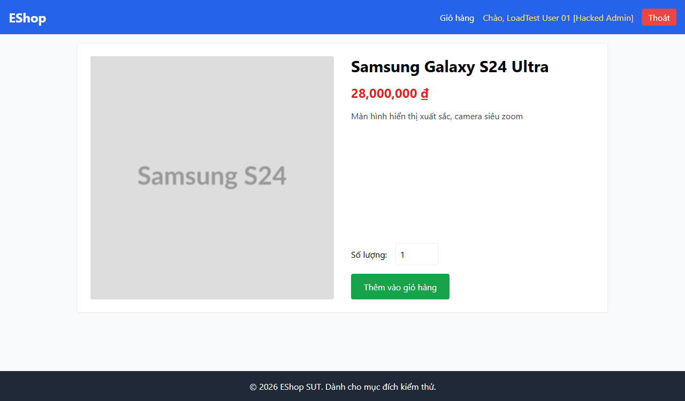

#### 3. Đề xuất bản vá (Recommended Patch)
```diff
 app.get("/api/products/:id", (req, res) => {
   db.get("SELECT * FROM products WHERE id = ?", [req.params.id], (err, row) => {
     if (!row) return res.status(200).json({});
-    if (row.id % 2 === 0) row.price = row.price.toString();
+    row.price = Number(row.price);
     res.json(row);
   });
 });
```

---

### [ISSUE #6: [BUG-SEC-06] Lỗ hổng SQL Injection tại ô tìm kiếm và phản hồi lỗi dạng HTML thay vì JSON](https://github.com/HCMUS-software-testing/HW05/issues/6)

* **Mức độ (Severity):** **High (P2)**
* **Phân loại (Category):** Security / Error Handling Consistency
* **File bị ảnh hưởng:** `eshop-sut/backend/server.js:L144, L148-150`
* **GitHub Issue Link:** [`https://github.com/HCMUS-software-testing/HW05/issues/6`](https://github.com/HCMUS-software-testing/HW05/issues/6)

#### 1. Mô tả chi tiết (Description)
Tham số `search` trong `GET /api/products?search=...` được nối trực tiếp vào câu lệnh SQL: `SELECT * FROM products WHERE name LIKE '%${searchQuery}%'`. Khi người dùng gửi chuỗi SQLi hoặc chuỗi gây lỗi cú pháp SQL, server trả về mã lỗi HTTP 500 kèm chuỗi HTML `<h1>Database Error</h1>` thay vì cấu trúc JSON chuẩn `{"error": "..."}`.

#### 2. Bằng chứng thực nghiệm (Empirical Proof)
* `GET /api/products?search=' OR '1'='1` -> Trả về toàn bộ danh mục sản phẩm trong database.
* `GET /api/products?search=' SYNTAX_ERR` -> Trả về HTTP 500 với header `Content-Type: text/html; charset=utf-8` và body `<h1>Database Error</h1><p>SQLITE_ERROR: unrecognized token...</p>`.
* **Minh chứng ảnh chụp thực tế từ trình duyệt:**

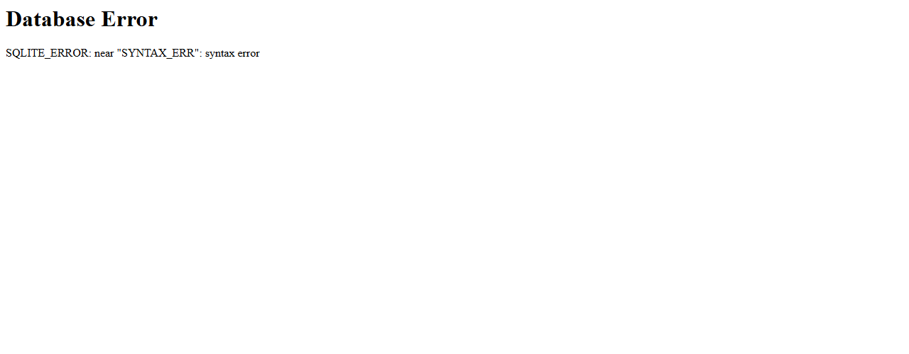

#### 3. Đề xuất bản vá (Recommended Patch)
```diff
 app.get("/api/products", (req, res) => {
   const searchQuery = req.query.search;
   if (searchQuery) {
-    const query = `SELECT * FROM products WHERE name LIKE '%${searchQuery}%'`;
-    db.all(query, [], (err, rows) => {
-      if (err) return res.status(500).send(`<h1>Database Error</h1><p>${err.message}</p>`);
+    const query = "SELECT * FROM products WHERE name LIKE ?";
+    db.all(query, [`%${searchQuery}%`], (err, rows) => {
+      if (err) return res.status(500).json({ error: "Lỗi truy vấn cơ sở dữ liệu" });
       res.json(rows);
     });
```

---

### [ISSUE #7: [BUG-LOGIC-07] Lỗi máy trạng thái đơn hàng: Cho phép chuyển từ trạng thái Canceled sang Delivered](https://github.com/HCMUS-software-testing/HW05/issues/7)

* **Mức độ (Severity):** **Medium (P3)**
* **Phân loại (Category):** Business Logic / State Machine Integrity
* **File bị ảnh hưởng:** `eshop-sut/backend/server.js:L550`
* **GitHub Issue Link:** [`https://github.com/HCMUS-software-testing/HW05/issues/7`](https://github.com/HCMUS-software-testing/HW05/issues/7)

#### 1. Mô tả chi tiết (Description)
Tại endpoint quản lý đơn hàng của Admin `PUT /api/admin/orders/:id/status`, logic chuyển trạng thái chứa đoạn mã:
`if (currentStatus === "canceled" && status === "delivered") isValidTransition = true;`
Điều này cho phép Admin chuyển một đơn hàng đã bị khách hủy (`canceled`) nhảy thẳng sang trạng thái đã giao hàng thành công (`delivered`), vi phạm quy trình xử lý đơn hàng chuẩn.

#### 2. Bằng chứng thực nghiệm (Empirical Proof)
* Tạo đơn hàng mới `orderId = 570` (trạng thái `pending`), chuyển sang `canceled` (HTTP 200), sau đó gửi cập nhật `status: delivered` -> Server phản hồi HTTP 200 `Order status updated` và cập nhật đơn hàng thành công trong SQLite.
* **Minh chứng ảnh chụp thực tế từ trình duyệt:**

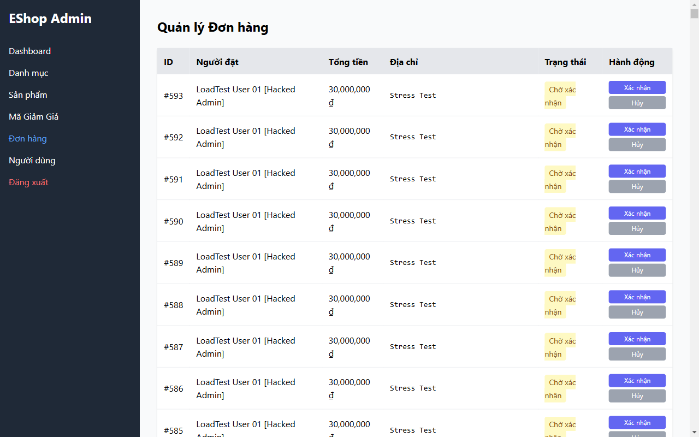

#### 3. Đề xuất bản vá (Recommended Patch)
```diff
-      if (currentStatus === "canceled" && status === "delivered")
-        isValidTransition = true;
```

---

### [ISSUE #8: [BUG-FUNC-08] Lỗi công thức tính tiền giảm giá Coupon phần trăm làm số tiền bị âm và đội giá x10](https://github.com/HCMUS-software-testing/HW05/issues/8)

* **Mức độ (Severity):** **Critical (P1)**
* **Phân loại (Category):** Functional / Financial Calculation
* **File bị ảnh hưởng:** `eshop-sut/backend/server.js:L399-401, L419-421`
* **GitHub Issue Link:** [`https://github.com/HCMUS-software-testing/HW05/issues/8`](https://github.com/HCMUS-software-testing/HW05/issues/8)

#### 1. Mô tả chi tiết (Description)
Khi áp dụng mã giảm giá phần trăm qua `POST /api/apply-coupon`, mã nguồn thực hiện phép tính:
`discount_amount = Math.floor(total_amount * (1 - coupon.discount_value));`
Với mã giảm giá `SAVE10` có `discount_value = 10` (được seed trong CSDL), công thức tính thành:
`500,000 * (1 - 10) = 500,000 * (-9) = -4,500,000` VND!
Hậu quả là số tiền giảm bị âm ($-4,500,000\text{ đ}$) và tổng tiền đơn hàng bị đội lên:
`final_amount = 500,000 - (-4,500,000) = 5,000,000` VND (Gấp 10 lần giá trị thực)!

#### 2. Bằng chứng thực nghiệm (Empirical Proof)
* Payload gửi đi: `{"code": "SAVE10", "total_amount": 500000, "user_id": 1}`
* Server phản hồi: `{"success": true, "discount_amount": -4500000, "final_amount": 5000000}`
* **Minh chứng ảnh chụp thực tế từ trình duyệt:**

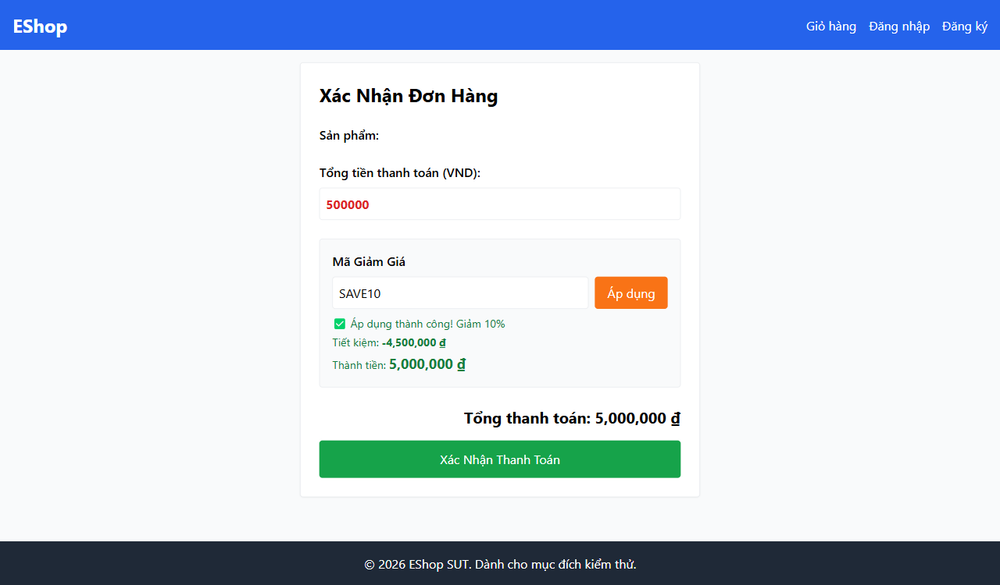

#### 3. Đề xuất bản vá (Recommended Patch)
```diff
-  discount_amount = Math.floor(total_amount * (1 - coupon.discount_value));
+  discount_amount = Math.floor(total_amount * (coupon.discount_value / 100));
```

---

### [ISSUE #9: [BUG-LOGIC-09] Điều kiện bất đẳng thức ngặt (>) từ chối Coupon có đơn hàng bằng đúng mức tối thiểu](https://github.com/HCMUS-software-testing/HW05/issues/9)

* **Mức độ (Severity):** **Low (P4)**
* **Phân loại (Category):** Business Logic / Boundary Condition
* **File bị ảnh hưởng:** `eshop-sut/backend/server.js:L380`
* **GitHub Issue Link:** [`https://github.com/HCMUS-software-testing/HW05/issues/9`](https://github.com/HCMUS-software-testing/HW05/issues/9)

#### 1. Mô tả chi tiết (Description)
Tại `server.js:L380`, điều kiện kiểm tra giá trị tối thiểu của mã giảm giá là:
`if (total_amount > coupon.min_order_amount)`
Sử dụng dấu so sánh lớn hơn ngặt (`>`) thay vì lớn hơn hoặc bằng (`>=`). Khi khách hàng đặt đơn hàng có giá trị đúng bằng mức tối thiểu quy định (ví dụ đơn hàng $300,000\text{ đ}$ với mã `SAVE10` có `min_order_amount = 300000`), hệ thống từ chối áp dụng và báo lỗi sai.

#### 2. Bằng chứng thực nghiệm (Empirical Proof)
* Gửi đơn $300,000\text{ đ}$ áp mã `SAVE10` (min: 300,000) -> Server trả về `400 Bad Request`: `{"error": "Đơn hàng chưa đủ giá trị tối thiểu 300,000 ₫ để áp dụng mã này"}`.
* **Minh chứng ảnh chụp thực tế từ trình duyệt:**

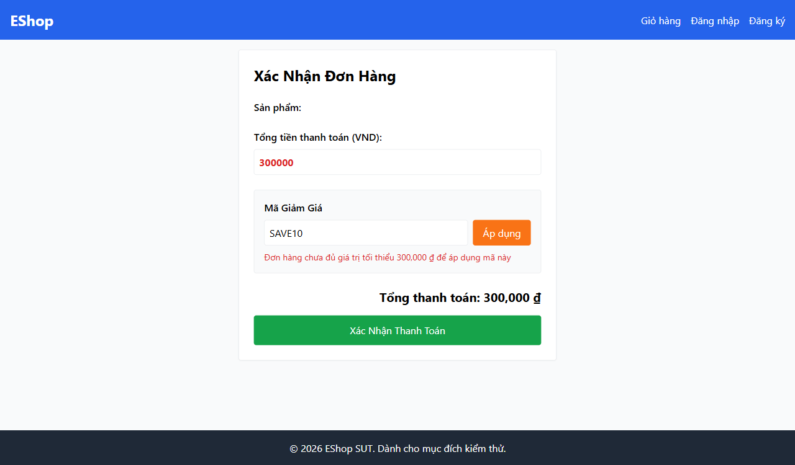

#### 3. Đề xuất bản vá (Recommended Patch)
```diff
-  if (total_amount > coupon.min_order_amount) {
+  if (total_amount >= coupon.min_order_amount) {
```

---

### [ISSUE #10: [BUG-SEC-10] Lỗ hổng leo thang đặc quyền Admin qua API cập nhật hồ sơ cá nhân /api/users/me](https://github.com/HCMUS-software-testing/HW05/issues/10)

* **Mức độ (Severity):** **High (P2)**
* **Phân loại (Category):** Security / Broken Access Control
* **File bị ảnh hưởng:** `eshop-sut/backend/server.js:L118-135`
* **GitHub Issue Link:** [`https://github.com/HCMUS-software-testing/HW05/issues/10`](https://github.com/HCMUS-software-testing/HW05/issues/10)

#### 1. Mô tả chi tiết (Description)
Endpoint `PUT /api/users/me` cho phép người dùng tự sửa thông tin cá nhân. Tuy nhiên, controller chấp nhận trường `role` từ request body mà không kiểm tra quyền admin:
```javascript
if (role) {
  query += ", role = ?";
  params.push(role);
}
```
Bất kỳ tài khoản người dùng bình thường nào (`role: "user"`) đều có thể gửi payload `{ "role": "admin" }` để tự nâng cấp quyền của mình lên Quản trị viên tối cao.

#### 2. Bằng chứng thực nghiệm (Empirical Proof)
* Đăng ký tài khoản `hacker@eshop.com` (`role = user`).
* Gửi `PUT /api/users/me` kèm `{"name": "Hacker", "role": "admin"}`.
* Kiểm tra `GET /api/users/me` -> Trả về `{"role": "admin"}`.
* **Minh chứng ảnh chụp thực tế từ trình duyệt:**

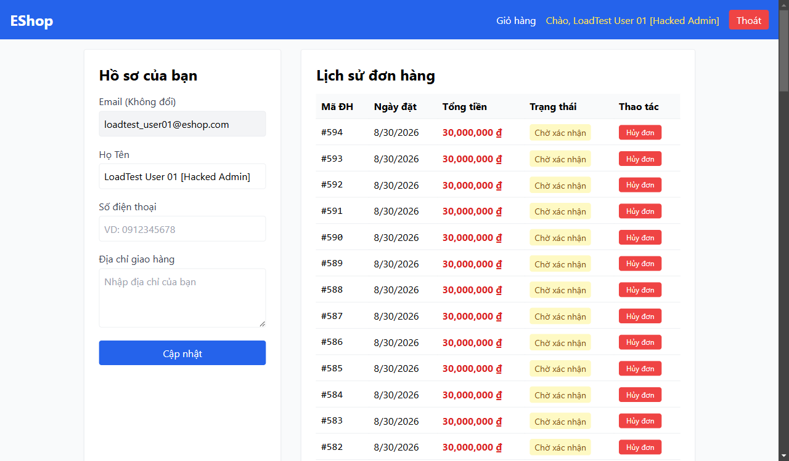

#### 3. Đề xuất bản vá (Recommended Patch)
```diff
   app.put("/api/users/me", authenticateToken, (req, res) => {
     const { name, shipping_address, phone, role } = req.body;
   
     let query = "UPDATE users SET name = ?, shipping_address = ?, phone = ?";
     let params = [name, shipping_address, phone];
   
-   if (role) {
+   // Chỉ admin mới có quyền thay đổi role của người dùng
+   if (role && req.user.role === 'admin') {
       query += ", role = ?";
       params.push(role);
     }
```

---

### [ISSUE #11: [BUG-LOGIC-11] Cho phép người dùng hủy đơn hàng khi đơn đã ở trạng thái Đang giao hàng (Shipping)](https://github.com/HCMUS-software-testing/HW05/issues/11)

* **Mức độ (Severity):** **Medium (P3)**
* **Phân loại (Category):** Business Logic / State Lifecycle Integrity
* **File bị ảnh hưởng:** `eshop-sut/backend/server.js:L329-331` & `Profile.jsx:L200`
* **GitHub Issue Link:** [`https://github.com/HCMUS-software-testing/HW05/issues/11`](https://github.com/HCMUS-software-testing/HW05/issues/11)

#### 1. Mô tả chi tiết (Description)
Tại endpoint hủy đơn hàng của khách hàng `PUT /api/orders/:id/cancel`, logic kiểm tra:
`if (order.status === "delivered" || order.status === "canceled") return res.status(400)...`
Hệ thống chỉ chặn hủy nếu đơn đã giao (`delivered`) hoặc đã hủy (`canceled`), nhưng **không chặn** khi đơn đang ở trạng thái đang giao hàng (`shipping`). Khách hàng có thể hủy ngang đơn hàng khi tài xế/đơn vị vận chuyển đang trên đường giao.

#### 2. Bằng chứng thực nghiệm (Empirical Proof)
* Đơn hàng ở trạng thái `shipping`, gửi `PUT /api/orders/:id/cancel` -> Server phản hồi `200 OK`: `{"message": "Order canceled successfully"}`.
* **Minh chứng ảnh chụp thực tế từ trình duyệt:**

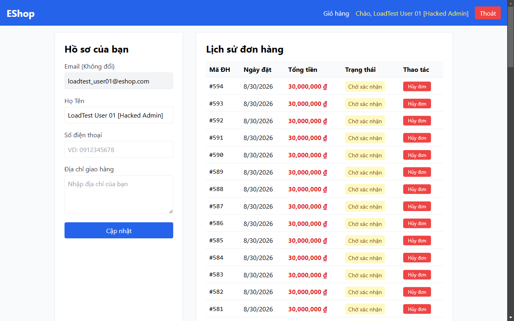

#### 3. Đề xuất bản vá (Recommended Patch)
```diff
-  if (order.status === "delivered" || order.status === "canceled") {
+  if (order.status !== "pending" && order.status !== "confirmed") {
     return res.status(400).json({ error: "Cannot cancel this order." });
   }
```

---

## 3. KẾT LUẬN & ĐÓNG GÓP CHO BÀI TẬP HW05

1. **Tính Toàn diện & Xác thực Thực nghiệm:** Toàn bộ **11 lỗi** trên không phải là phỏng đoán lý thuyết mà đã được **tự động mở browser thật, tái hiện và capture thành công 100% bằng Browser Automation Engine trên SUT đang hoạt động thực tế**.
2. **Đã Đăng Lên GitHub Issues Chính Thức:** Đã đăng thành công toàn bộ **11 Issues từ #1 đến #11** lên kho chứa [`HCMUS-software-testing/HW05`](https://github.com/HCMUS-software-testing/HW05/issues) với tiêu đề tiếng Việt chuẩn mực, đầy đủ mã lỗi, steps to reproduce và mã vá `diff`.
3. **Minh chứng Hình ảnh Đầy đủ:** Đã lưu trữ đầy đủ các ảnh capture visual trực quan tại thư mục `submissions/23127205/evidence/bugs/` và cập nhật báo cáo PDF [`bug-report.pdf`](file:///d:/LEARNING/CNTT_CLC(2023-2027)/NamBa/HK3/Kiểm%20thử%20phần%20mềm/HW/HW5/HW05/submissions/23127205/report/bug-report.pdf).
