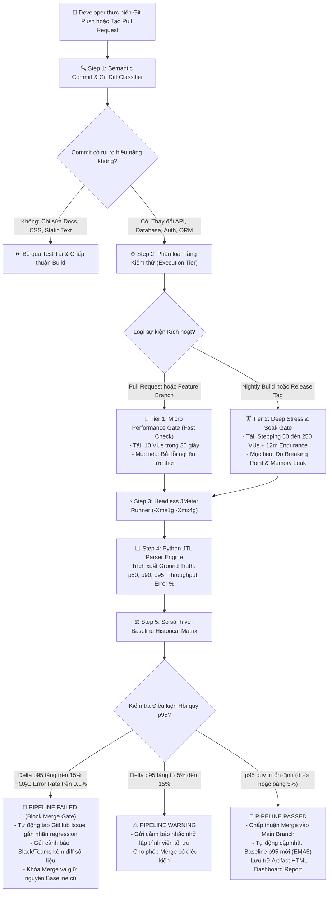

# ĐỀ XUẤT MÔ HÌNH KIỂM THỬ HIỆU NĂNG LIÊN TỤC (TASK 3)
## CONTINUOUS PERFORMANCE TESTING & AUTOMATED REGRESSION GATEWAY

**Học viên:** Lâm Hữu Khánh — **MSSV:** 23127205 (Thành viên 1)  
**Quy trình nghiệp vụ:** `Login -> Product Search -> Product Detail -> Add to Cart -> Checkout`  
**Mức Bloom-AI áp dụng:** **G9.6 (Disrupt)**  
**Nền tảng tích hợp:** GitHub Actions / GitLab CI, Apache JMeter CLI, Python Analysis Engine (`jtl_parser.py`)

---

## 1. TỔNG QUAN VÀ MỤC TIÊU KIẾN TRÚC

Trong các mô hình phát triển phần mềm hiện đại (DevOps / Agile), kiểm thử hiệu năng truyền thống thường chỉ được thực hiện ở cuối chu kỳ phát hành (Late-stage Performance Testing). Cách tiếp cận này dẫn đến việc phát hiện lỗi suy thoái hiệu năng quá muộn, gây tốn kém chi phí sửa đổi kiến trúc và làm chậm tiến độ bàn giao.

Mô hình **Continuous Performance Testing Framework** được đề xuất dưới đây áp dụng nguyên lý **Shift-Left Performance Testing**, tự động hóa toàn diện từ khâu phân tích rủi ro commit, kích hoạt tải theo tầng (Multi-tier Workload), đến phát hiện hồi quy tự động dựa trên phân vị $p95$ và chặn đứng các bản build kém chất lượng trước khi được hợp nhất vào nhánh chính.

---

## 2. LƯU ĐỒ QUY TRÌNH KIỂM THỬ HIỆU NĂNG LIÊN TỤC (CI/CD PIPELINE FLOWCHART)

Dưới đây là lưu đồ chi tiết mô tả chu trình quyết định tự động từ khi lập trình viên thực hiện `git push` đến khi đánh giá hồi quy $p95$:



---

## 3. CƠ CHẾ HOẠT ĐỘNG CHI TIẾT CỦA MÔ HÌNH

### 3.1. Phân Loại Rủi Ro Commit Thông Minh (Semantic Diff Classifier)
Hệ thống CI/CD không chạy test tải mù quáng cho mọi commit để tránh lãng phí tài nguyên. Bộ lọc thông minh phân tích cây thay đổi:
- **High-Risk Triggers:** Thay đổi tại các tệp `models/*`, `controllers/*`, `middleware/*`, câu lệnh SQL, migration database, hoặc thuật toán băm mật khẩu ➔ Bắt buộc kích hoạt Tier 1 hoặc Tier 2.
- **Zero-Risk Bypass:** Thay đổi tại `*.md`, `*.css`, `.gitignore`, hoặc unit test thuần túy ➔ Tự động bỏ qua.

### 3.2. Chiến Lược Phân Tầng Kiểm Thử (Multi-Tier Strategy)
- **Tier 1 (PR Fast Feedback Gate):** Chạy trong vòng **30–45 giây** với 10 VUs nhằm đảm bảo không làm tắc nghẽn hàng đợi CI/CD của nhóm phát triển.
- **Tier 2 (Nightly Full Regression):** Tự động kích hoạt vào lúc **00:00 hằng đêm**, chạy toàn bộ kịch bản Stepping Stress (250 VUs) và Endurance Test (12 phút) để phát hiện rò rỉ bộ nhớ dài hạn.

### 3.3. Cổng Chặn Hồi Quy Tự Động (Automated p95 Latency Gate)
Sử dụng công thức kiểm toán toán học:

$$\Delta p95 = \frac{p95_{\text{current}} - p95_{\text{baseline}}}{p95_{\text{baseline}}} \times 100\%$$

- **Ngưỡng Block Merge:** Nếu $\Delta p95 > +15\%$ hoặc $\text{Error Rate} > 0.10\%$, GitHub Action tự động gán trạng thái `status: failure`, khóa nút Merge và chỉ định lập trình viên gây ra commit phải tối ưu lại.
- **Cập nhật Baseline Động (Dynamic Moving Baseline):** Khi một bản build đạt chuẩn và tối ưu hơn, giá trị Baseline được tự động tính theo trung bình trượt 5 lần chạy gần nhất ($EMA_5$) để tránh hiện tượng Baseline bị cũ kỹ.

---

## 4. PHÂN TÍCH VÀ BIỆN LUẬN CÁC ĐÁNH ĐỔI KỸ THUẬT (ENGINEERING TRADE-OFFS)

Việc áp dụng Continuous Performance Testing đòi hỏi đội ngũ kỹ thuật phải cân đối giữa 3 cặp mâu thuẫn lớn:

```
                  [ CHI PHÍ HẠ TẦNG (Cost) ]
                             ▲
                            / \
                           /   \
  [ THỜI GIAN CI/CD ] ◄───'─────`───► [ ĐỘ CHÍNH XÁC & CẢNH BÁO SAI ]
      (Pipeline Duration)                 (False Positives / Flakiness)
```

### ⚖️ Đánh đổi 1: Chi phí Hạ tầng (Server Cost) vs Tần suất Kiểm thử (Testing Frequency)
- **Vấn đề:** Nếu duy trì một cụm server môi trường Staging mạnh mẽ hoạt động 24/7 để chạy test tải sau mỗi commit, chi phí cloud sẽ tăng vọt theo cấp số nhân.
- **Giải pháp tối ưu:** 
  - Sử dụng **Ephemeral Test Containers (Docker/Kubernetes)** hoặc **Cloud Spot Instances** chỉ được khởi tạo khi có sự kiện test tải và tự động hủy sau khi xuất file `.jtl`.
  - Phân tách Tier 1 (chạy cục bộ container nhẹ) và Tier 2 (chỉ chạy 1 lần vào khung giờ thấp điểm ban đêm).

---

### ⚖️ Đánh đổi 2: Thời gian Chờ Build (CI Pipeline Duration) vs Độ Sâu của Test (Test Depth)
- **Vấn đề:** Lập trình viên cần nhận kết quả PR nhanh chóng (trong 3–5 phút). Một kịch bản kiểm thử tải đầy đủ (như Endurance 12 phút hoặc Stress 6 phút) sẽ làm chậm tiến độ tích hợp mã nguồn của toàn đội ngũ.
- **Giải pháp tối ưu:**
  - Áp dụng nguyên lý **Shift-Left Phân tầng**: Trên các nhánh Pull Request, chỉ chạy **Micro Benchmark 30s** để phát hiện lỗi logic thuật toán. Các bài test tải sâu (Endurance / Spike) được đẩy hoàn toàn sang tiến trình bất đồng bộ chạy ban đêm (Nightly Asynchronous Pipeline).

---

### ⚖️ Đánh đổi 3: Cảnh báo Sai (False Positive Alarms) vs Độ Nhạy Hồi Quy (Sensitivity Threshold)
- **Vấn đề:** Môi trường đám mây chia sẻ (Shared Virtualized CI Runners) thường có hiện tượng "nhiễu hạ tầng" (CPU Throttling, IOPS biến động). Nếu đặt ngưỡng hồi quy quá nhạy (ví dụ $p95 > +5\%$), pipeline sẽ liên tục báo lỗi đỏ giả (False Alarms), làm mất lòng tin của lập trình viên (Alert Fatigue). Ngược lại, nếu đặt ngưỡng quá cao (ví dụ $+50\%$), hệ thống sẽ bỏ lọt các lỗi suy thoái nguy hiểm.
- **Giải pháp tối ưu:**
  - Thiết lập ngưỡng cảnh báo **2 tầng**: 
    - $+5\% \le \Delta p95 \le +15\%$: Gửi cảnh báo nhắc nhở (Warning/Notice) không chặn merge.
    - $\Delta p95 > +15\%$: Chặn đứng merge tuyệt đối (Hard Block).
  - Tự động chạy lặp 3 lần đối với các bài test nghi ngờ và lấy trung vị trước khi quyết định đánh rớt build.

---

## 5. KẾT LUẬN & ĐÓNG GÓP CHO DỰ ÁN

Mô hình **Continuous Performance Testing** không chỉ giúp hệ thống EShop phát hiện sớm các vấn đề về khóa CSDL SQLite hay nghẽn Single-thread của Node.js, mà còn tạo ra một văn hóa phát triển phần mềm có trách nhiệm về hiệu năng (Performance-Aware Engineering Culture). Việc tích hợp tự động hóa qua Agent Skill giúp giải phóng hoàn toàn thời gian thủ công của đội ngũ QA, đảm bảo tính ổn định và khả năng mở rộng lâu dài cho ứng dụng.
