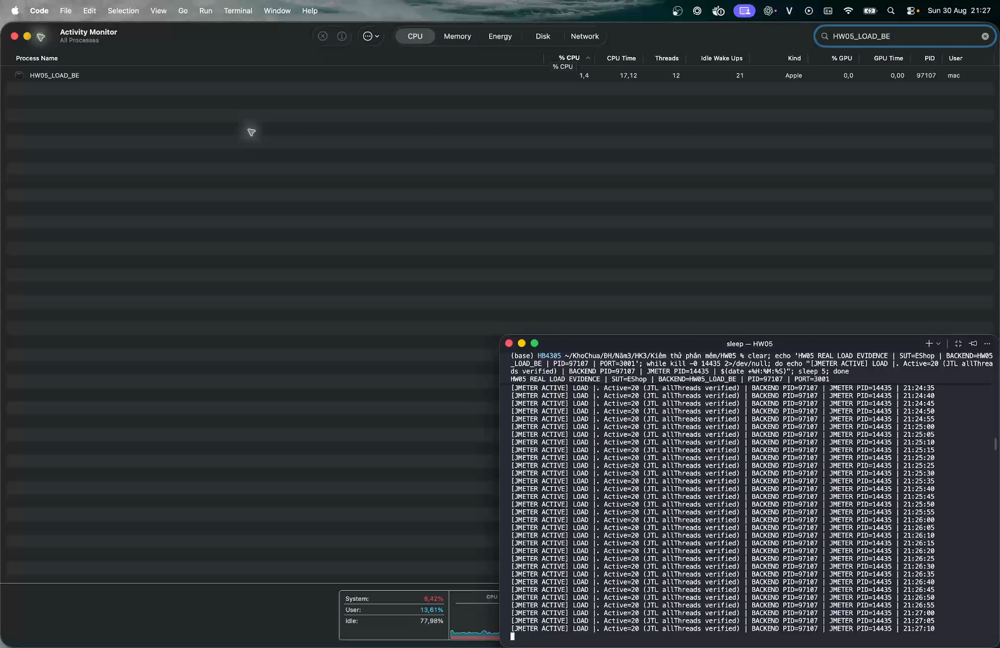
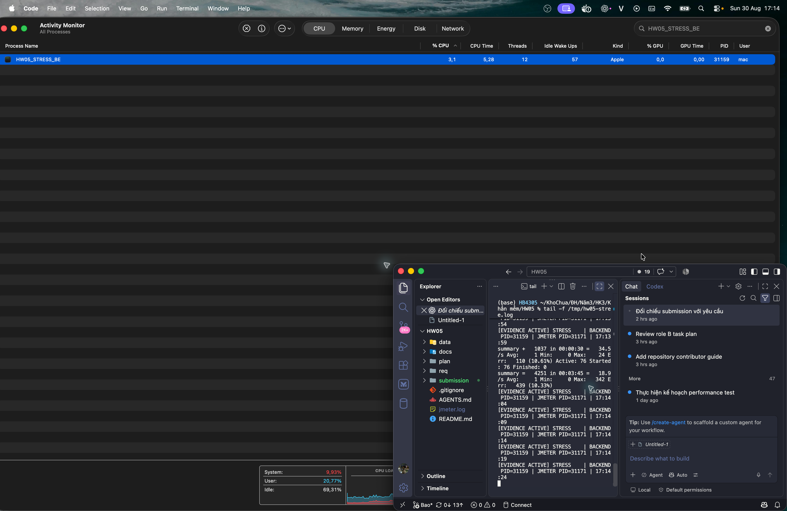
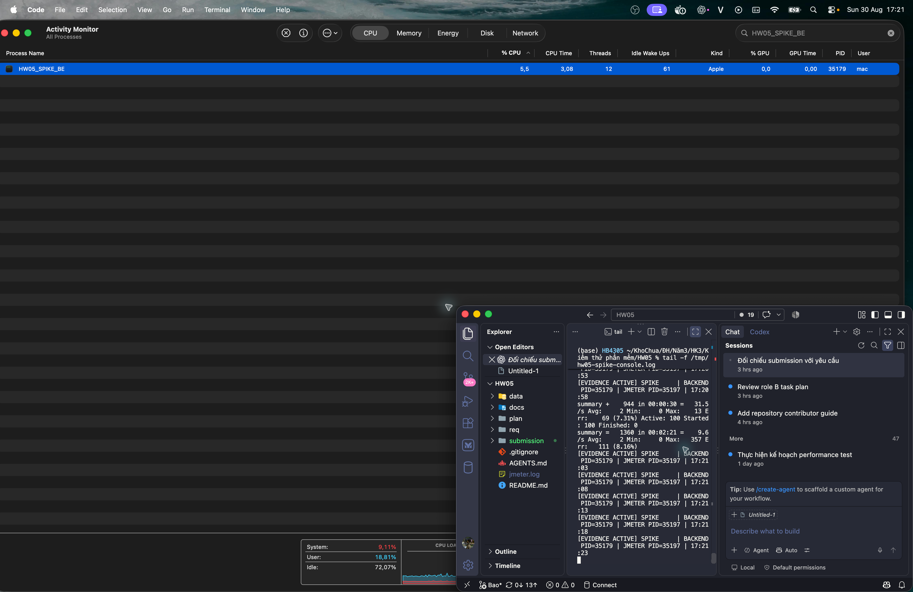
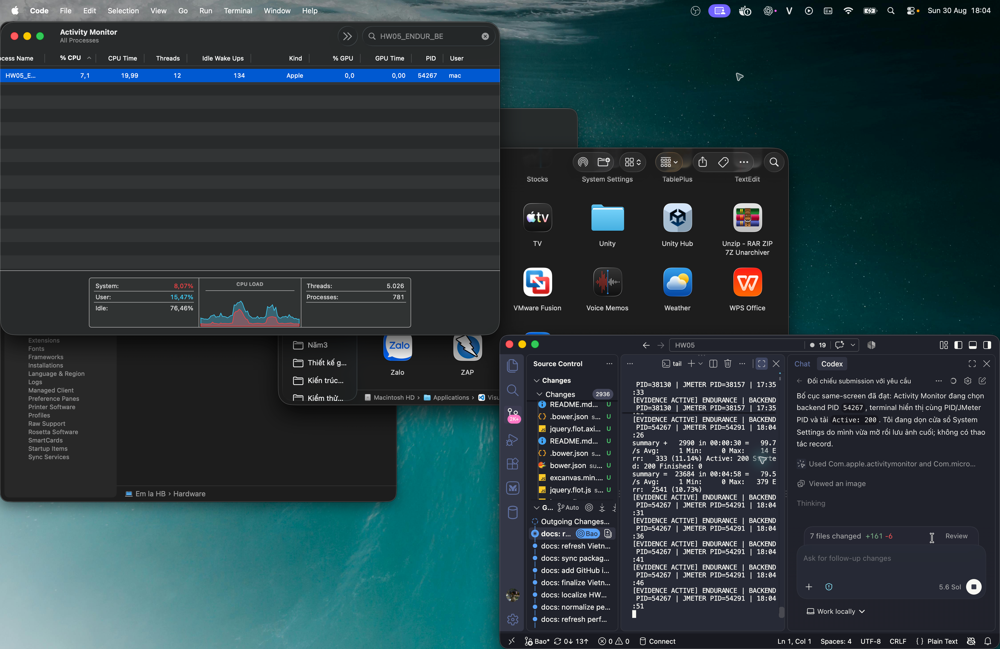

# HW05 - Kiểm thử hiệu năng - Thành viên 3

## Trạng thái

Đây là bài nộp workflow của Thành viên 3. MSSV `23127326`; ngày chạy local `2026-08-30`. Tài khoản kiểm thử, JTL thô, báo cáo HTML và số liệu đều được sinh từ các lần chạy thật.

Các CSV dùng tài khoản kiểm thử do `tools/provision_sut.py` tạo trên SUT local. Không dùng dữ liệu cá nhân thật.

Kho GitHub công khai: `https://github.com/HB4305/23127326-HW05-AI-Performance`

## Quy trình

`Lockout probe -> login hợp lệ -> lọc/tìm sản phẩm -> thêm sản phẩm -> gửi quantity cập nhật -> đọc cart -> checkout -> kiểm tra cart sau checkout`

| Nhóm          | Endpoint                                                | Kiểm tra chính                                                             |
| ------------- | ------------------------------------------------------- | -------------------------------------------------------------------------- |
| Auth-heavy    | `POST /api/login`                                       | HTTP 200, JSON có `token`; lockout probe riêng kiểm tra 3 lần sai          |
| Read-heavy    | `GET /api/products?search=...&page=...&limit=...`       | HTTP 200, mảng không rỗng, tên khớp từ khóa; ghi nhận SUT không phân trang |
| Transactional | `POST /api/cart`, `GET /api/cart`, `POST /api/checkout` | Dữ liệu CSV, token, orderId và các kiểm tra gap về quantity/cart           |

## Cách chạy

1. Tạo 200 tài khoản `perf.m3.*` riêng cho workflow này nếu chạy cả staircase đến 200 VU; ba workload gốc cần tối đa 100 tài khoản.
2. Điền `data/credentials.csv`, `data/lockout-account.csv` và kiểm tra `data/products.csv`, `data/orders.csv`.
3. Chạy SUT tại `http://localhost:3000`; cài JMeter và kiểm tra `jmeter --version`.
4. Chạy smoke trước, sau đó chạy lần đo chính thức với thư mục output mới:

```bash
jmeter -n \
  -t submissions/23127326/test-plans/23127326_Load_20260830.jmx \
  -JdataDir=submissions/23127326/data \
  -JbaseUrl=http://localhost:3000 \
  -JdurationSeconds=360 \
  -l submissions/23127326/results/resource-rerun/load/23127326_Load_resource_20260830.jtl \
  -e -o submissions/23127326/results/resource-rerun/load/html-20260830
```

Thay `Load` bằng `Stress` hoặc `Spike` và dùng thư mục output riêng. Duration của Load/Stress là tổng thời gian gồm ramp-up và hold (`360 s` / `480 s`). Ba listener trong JMX được tắt khi chạy non-GUI; chúng chỉ dùng làm các dạng báo cáo khi mở plan/JTL bằng giao diện.

## Tóm tắt kết quả và ngưỡng endurance

| Kịch bản            |      VU |          Mẫu/s |       HTTP RPS |  p95 | HTTP/network | CPU backend tối đa | RSS tối đa |
| ------------------- | ------: | -------------: | -------------: | ---: | -----------: | -----------------: | ---------: |
| Load                |      20 |         9.1583 |         7.1076 | 6 ms |           0% |              16.4% |    75.8 MB |
| Stress              |     100 |        34.4137 |        26.7113 | 5 ms |           0% |              17.4% |   120.8 MB |
| Spike               | 10 + 90 |        17.1228 |        13.2665 | 5 ms |           0% |              25.5% |    90.5 MB |
| Endurance threshold |     200 | 99.5533 (hold) | 77.4400 (hold) | 5 ms |           0% |              17.7% |   119.3 MB |

Mẫu/s bao gồm cả sampler nội bộ; HTTP RPS chỉ đếm JTL row có URL. Staircase 70/100/150/200 VU đều đạt SLO; soak mức cao nhất giữ đủ 600 giây với **77.4400 HTTP RPS**, p95 5 ms, HTTP error 0%, CPU tối đa 17.7%, RSS trần 119.3 MB và RSS cuối hold 109.3 MB. Đây là maximum stable observed trong dải đã thử; tiêu chí fail của mức kế tiếp được ghi trong `main-report.md`. Có 4 lỗi nghiệp vụ đã tái hiện và tạo GitHub Issue #1-#4; evidence response và ảnh issue nằm trong `evidence/issues/`.

## Ghi chú bàn giao

- Video Agent Skill và video performance demo đã được bổ sung bên dưới; video performance có thuyết minh tiếng Việt và hiển thị JMeter cùng resource monitor trong một khung hình.
- Bốn ảnh combined Load, Stress, Spike và Endurance đều là screenshot thật cùng phiên. Load hiển thị `Active=20` và backend PID `97107`; ba PID còn lại lần lượt là `31159`, `35179`, `54267`; tất cả khớp Activity Monitor.
- Ba listener vẫn tắt trong non-GUI run để không ảnh hưởng phép đo. Bộ JTL canonical đã được nạp sau chạy vào View Results Tree, Summary Report và Aggregate Report; ba ảnh tương ứng nằm trong `evidence/screenshots/`.
- Evidence resource hợp lệ nằm trong `evidence/hardware/`; thông số phần cứng nằm trong `evidence/hardware/hardware-20260830.png` và file văn bản đi kèm.

Báo cáo chính, AI Audit, AI Critique và Continuous Performance Testing nằm trong thư mục gốc submission.

Ảnh evidence chính:









## Self-assessment

Chỉ điền sau khi hoàn tất và kiểm tra evidence thật.

| Tiêu chí                          |                         Điểm tự đánh giá |
| --------------------------------- | ---------------------------------------: |
| Kiểm thử Load                     |                                    30/30 |
| Kiểm thử Stress                   |                                    20/20 |
| Kiểm thử Spike                    |                                    20/20 |
| Phân tích AI và săn lỗi diễn giải |                                    10/10 |
| Kiểm thử hiệu năng liên tục       |                                    10/10 |
| Agent Skill                       | 10/10 - đã có video minh họa Agent Skill |
| **Tổng**                          |                              **100/100** |

Video performance demo YouTube không công khai, tối thiểu 6 phút: <https://youtu.be/lAfLKjpHHRM> — sinh viên tự quay.

Video demo Agent Skill: <https://youtu.be/-QRnhBWwJL0>.
