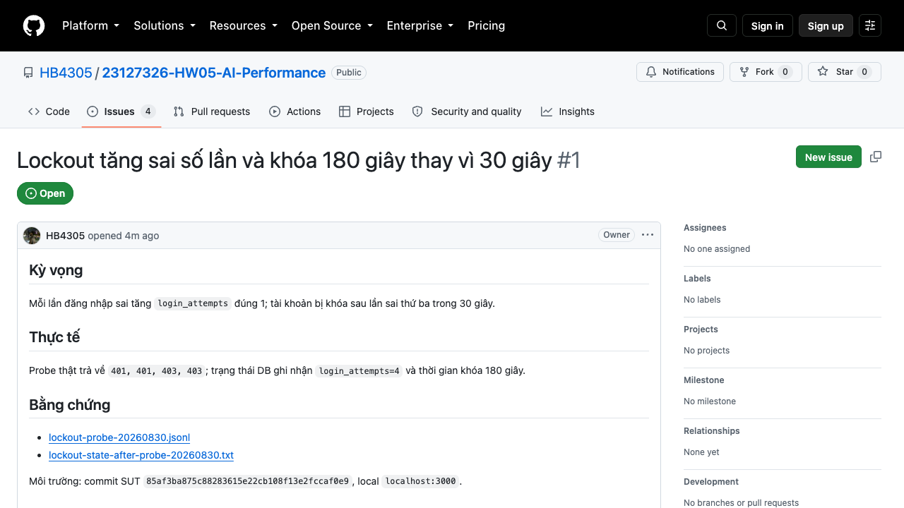
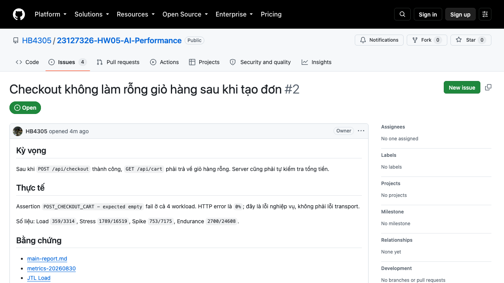
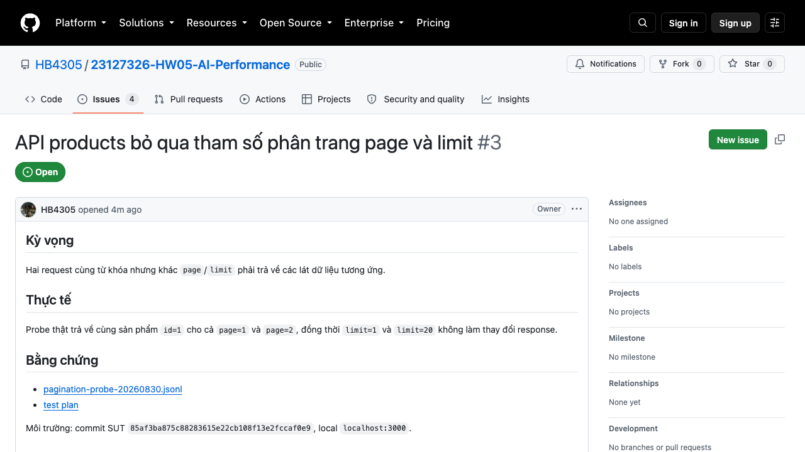
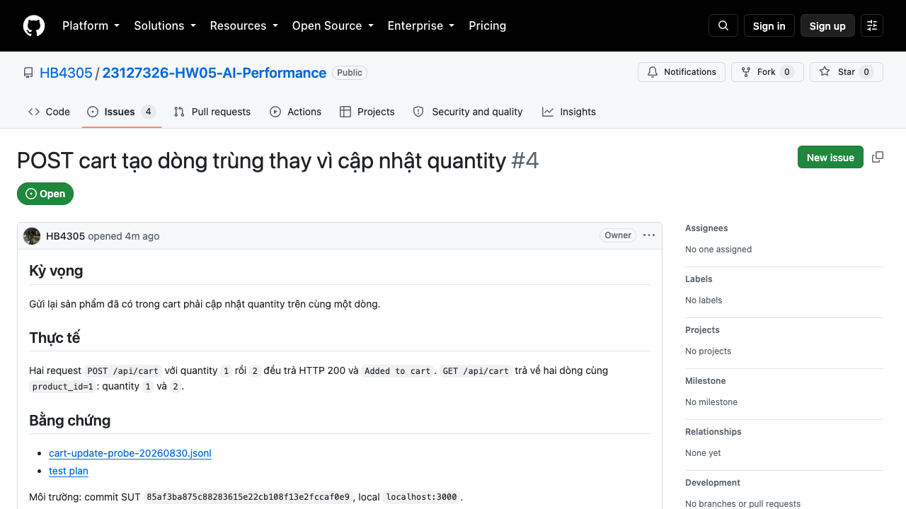

# Các issue và candidate lỗi

Kho GitHub công khai: <https://github.com/HB4305/23127326-HW05-AI-Performance>

Đã tạo 4 GitHub Issue cho các lỗi có bằng chứng tái hiện. Mỗi issue có response evidence, đường dẫn issue công khai và ảnh trang GitHub được nhúng bên dưới.

| Candidate | Kỳ vọng | Thực tế | Bằng chứng |
| --- | --- | --- | --- |
| Lockout counter/window | Mỗi login sai tăng +1; khóa sau 3 lần; 30 s | **Đã tái hiện**: status `401, 401, 403, 403`; DB attempts `4`; thời gian khóa `180 s` | [Response evidence](evidence/issues/lockout-probe-20260830.jsonl), [state sau probe](evidence/issues/lockout-state-after-probe-20260830.txt), [GitHub Issue #1](https://github.com/HB4305/23127326-HW05-AI-Performance/issues/1),  |
| Checkout cleanup/total | Server tự tính total và làm rỗng cart | **Đã tái hiện**: assertion `POST_CHECKOUT_CART` fail ở cả 4 workload; HTTP error `0%` | [Metric canonical](report/metrics-resource-rerun-20260830/), [GitHub Issue #2](https://github.com/HB4305/23127326-HW05-AI-Performance/issues/2),  |
| Product pagination | `page`/`limit` phải thay đổi phần tử trả về | Đã probe độc lập; SUT chỉ lọc `search`, chưa phân trang | [Response evidence](evidence/issues/pagination-probe-20260830.jsonl), [GitHub Issue #3](https://github.com/HB4305/23127326-HW05-AI-Performance/issues/3),  |
| Cart quantity update | Một sản phẩm giữ một dòng với quantity mới | Đã probe độc lập; request POST lần hai tạo dòng sản phẩm trùng | [Response evidence](evidence/issues/cart-update-probe-20260830.jsonl), [GitHub Issue #4](https://github.com/HB4305/23127326-HW05-AI-Performance/issues/4),  |

## Ảnh issue evidence

Các ảnh dưới đây là ảnh chụp thật trang GitHub Issues tương ứng với các đường dẫn ở bảng trên.

### GitHub Issue #1 — Lockout

### GitHub Issue #2 — Checkout

### GitHub Issue #3 — Pagination

### GitHub Issue #4 — Cart quantity

Các lỗi HTTP/network được phân biệt với assertion nghiệp vụ. Không sửa SUT để làm kết quả đẹp.
