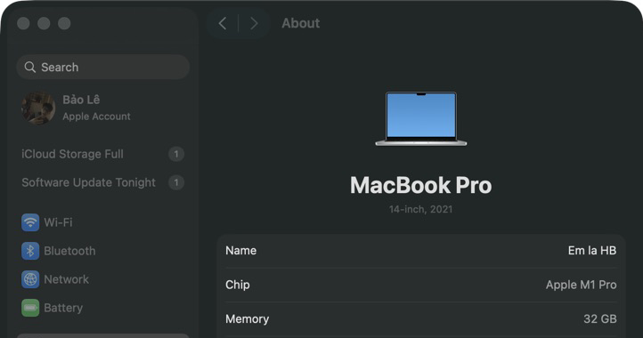

# Báo cáo kiểm thử hiệu năng HW05

> MSSV: `23127326`; ngày chạy: `2026-08-30`. Số liệu lấy từ JTL thô chính thức và script analyzer đi kèm. Không dùng các lần chạy invalid trong `results/invalid-*`.

## Tóm tắt kỹ thuật

- Bộ `resource-rerun` là nguồn canonical cho Load/Stress/Spike và baseline Endurance 70 VU; mọi HTTP error đều bằng 0. Tỷ lệ fail 10-11% là assertion cart sau checkout, không phải server error.
- Staircase 70/100/150/200 VU đều đạt SLO. Mức cao nhất được thử, 200 VU, sau đó giữ đủ 600 giây và duy trì **77,4400 HTTP RPS**, p95 tổng 5 ms, HTTP error 0%, CPU tối đa 17,7% và RSS tối đa 119,3 MB.
- Ngưỡng vận hành thực nghiệm được chọn là **200 VU / 77,4400 HTTP RPS trong phạm vi staircase đã thiết kế**. Không suy diễn đây là trần tuyệt đối vượt quá 200 VU; mức tiếp theo chỉ được chấp nhận nếu đạt cùng tiêu chí fail/pass được nêu dưới đây.

## 1. Thông tin thực thi

| Trường | Giá trị |
| --- | --- |
| MSSV | `23127326` |
| Hostname | `192.168.11.208` |
| Commit/phiên bản SUT | `85af3ba875c88283615e22cb108f13e2fccaf0e9` |
| Phiên bản JMeter | `5.6.3` |
| Hệ điều hành/phần cứng | MacBook Pro 18,3; Apple M1 Pro; 10 cores; 32 GB RAM; macOS 26.5.2 |
| Địa chỉ SUT | `http://localhost:3000` |
| Ngày chạy | `2026-08-30` |

Kho GitHub công khai: `https://github.com/HB4305/23127326-HW05-AI-Performance`

## 2. Workflow và endpoint map

1. `POST /api/login` với credentials riêng từng VU; lấy JWT từ response.
2. `GET /api/products` với `search`, `page`, `limit` từ CSV; kiểm tra 200, array không rỗng và tên khớp.
3. `POST /api/cart` với quantity ban đầu.
4. Gửi lại `POST /api/cart` với quantity cập nhật, rồi `GET /api/cart`.
5. Tính `orderTotal` từ giá đã extract và quantity cập nhật; `POST /api/checkout`.
6. `GET /api/cart` sau checkout để kiểm tra cart phải rỗng.

## 3. Review của người đối với các khoảng cách đã giữ lại

| Quy tắc đặc tả | Hành vi implementation cần xác minh | Cách đo/ghi nhận |
| --- | --- | --- |
| Sai login tăng đúng 1 và khóa sau lần 3 trong 30 s | server hiện cộng 2 và dùng 180 s | lockout probe riêng, ghi status/body và thời gian |
| `page`/`limit` phải phân trang | server hiện chỉ đọc `search` | so sánh response với nhiều page/limit |
| Thêm cùng sản phẩm tăng quantity trong một dòng | server hiện `push` dòng mới | cart response + số dòng matching |
| Checkout tự tính total và xóa cart | server nhận `total_amount` từ client và không xóa cart | so sánh request/response/cart sau checkout |

Các gap trên không được tính nhầm thành lỗi transport. Báo cáo riêng `HTTP/network`, `assertion/business-gap` và `thread stopped`.

## 4. Thiết lập kịch bản

| Kịch bản | Threads | Ramp-up | Thời lượng | JTL thô | Báo cáo HTML |
| --- | ---: | ---: | ---: | --- | --- |
| Load | 20 | 60 s | 300 s (tổng 360 s) | `results/resource-rerun/load/23127326_Load_resource_20260830.jtl` | `results/resource-rerun/load/html-20260830/` |
| Stress | 100 | 300 s | 180 s (tổng 480 s) | `results/resource-rerun/stress/23127326_Stress_resource_20260830.jtl` | `results/resource-rerun/stress/html-20260830/` |
| Spike | 10 nền + 90 spike | 5 s spike | nền 420 s, spike 120 s sau delay 120 s | `results/resource-rerun/spike/23127326_Spike_resource_20260830.jtl` | `results/resource-rerun/spike/html-20260830/` |
| Endurance baseline | 70 VU | 210 s | 600 s giữ tải (tổng 810 s) | `results/resource-rerun/endurance/23127326_Endurance_resource_20260830.jtl` | `results/resource-rerun/endurance/html-20260830/` |
| Staircase screening | 70/100/150/200 VU | 30/30/45/60 s | mỗi mức giữ 90 s | `results/staircase-20260830/{70vu,100vu,150vu,200vu}/*.jtl` | JSON metrics theo từng mức |
| Endurance threshold | 200 VU | 120 s | 600 s giữ tải (tổng 720 s) | `results/staircase-20260830/endurance-200vu/23127326_Endurance_200VU_20260830.jtl` | `results/staircase-20260830/endurance-200vu/html-20260830/` |

## 5. Kết quả

### 5.1 Bộ canonical dùng để phản biện AI

Đã chạy analyzer bằng `agent-skill/.../analyze_jtl.py`; tính số mẫu, throughput, mean, median, p90, p95, p99, max và error rate theo từng label (`AUTH`, `READ`, `CART_ADD`, `CART_UPDATE`, `CART_GET`, `CHECKOUT`, `POST_CHECKOUT_CART`) sau khi đọc file metrics sinh ra.

| Kịch bản (resource-rerun) | Số mẫu | Lỗi transport/HTTP % | Assertion/gap nghiệp vụ % | p95 tổng / p95 label cao nhất | Mẫu/s | HTTP RPS | CPU tối đa / RSS tối đa |
| --- | ---: | ---: | ---: | ---: | ---: | ---: | --- |
| Load | 3,287 | 0.00% | 10.83% (356) | 6 / 8 ms | 9.1583 | 7.1076 | 16.4% / 75.8 MB |
| Stress | 16,433 | 0.00% | 10.83% (1,780) | 5 / 7 ms | 34.4137 | 26.7113 | 17.4% / 120.8 MB |
| Spike | 7,171 | 0.00% | 10.47% (751) | 5 / 7 ms | 17.1228 | 13.2665 | 25.5% / 90.5 MB |
| Endurance | 24,574 | 0.00% | 10.98% (2,699) | 6 / 8 ms | 30.4315 | 23.6465 | 19.6% / 85.6 MB |

Mean tổng thể: Load 2.642 ms; Stress 1.914 ms; Spike 2.041 ms; Endurance 2.443 ms. Mean/median/p90/p95/p99/max theo label được lưu trong `report/metrics-resource-rerun-20260830/*.json`; JTL thô và HTML của resource-rerun nằm trong `results/resource-rerun/`.

Diễn giải: mọi mẫu fail đều do assertion có chủ đích `POST_CHECKOUT_CART - expected empty`. Không có lỗi transport/HTTP. Đây là gap nghiệp vụ đã tái hiện của SUT, không phải lỗi hiệu năng. Response time đo được thấp hơn threshold p95 1.000 ms. Resource-rerun có CPU tối đa 16,4-25,5%; RSS tối đa 75,8-120,8 MB; tối đa 11 thread ở mọi run. RSS Endurance dao động 70,1-85,6 MB, vì vậy không kết luận leak vượt quá mẫu này.

`Mẫu/s` tính cả hai sampler nội bộ `SETUP_BASE_URL` và `CALCULATE_ORDER_TOTAL`; `HTTP RPS` chỉ đếm các dòng JTL có URL request. Không dùng tổng sample throughput làm RPS mạng.

Ngưỡng đánh giá: transport/HTTP < 1%, p95 < 1000 ms, CPU backend < 85%, memory không tăng liên tục và throughput không suy giảm trong ba cửa sổ liên tiếp. Lần Endurance 70 VU canonical cũ duy trì 23.6465 HTTP RPS trong 600 giây giữ tải; ngưỡng thay thế được xác định bằng staircase/soak ở phần kế tiếp.

### 5.2 Staircase và ngưỡng endurance thay thế

Mỗi bậc screening có 90 giây giữ đúng concurrency mục tiêu. `HTTP RPS giữ tải` chỉ đếm sample có URL; p95 tổng vẫn tính toàn bộ JTL để có phép so nhất quán với analyzer. Cả bốn bậc dùng cùng backend PID `4341` và cùng fixture 200 tài khoản, sau đó soak 200 VU chạy trên chính PID đó.

| Run | HTTP RPS giữ tải | p95 tổng / p95 label cao nhất | HTTP error | Assertion checkout | CPU tối đa trong hold | RSS tối đa |
| --- | ---: | ---: | ---: | ---: | ---: | ---: |
| 70 VU | 26.4667 | 7 / 10 ms | 0.00% | 372/3,631 | 6.1% | 76.1 MB |
| 100 VU | 38.0778 | 7 / 10 ms | 0.00% | 535/5,197 | 8.5% | 87.4 MB |
| 150 VU | 56.8778 | 7 / 9 ms | 0.00% | 864/8,328 | 11.8% | 101.3 MB |
| 200 VU screening | 76.5222 | 6 / 9 ms | 0.00% | 1,235/11,922 | 13.7% | 118.2 MB |
| **200 VU endurance** | **77.4400** | **5 / 8 ms** | **0.00%** | **7,226/65,859** | **17.7%** | **119.3 MB** |

Ở 200 VU, ba cửa sổ 200 giây của đoạn soak đạt lần lượt 77.8950, 77.3650 và 77.0600 HTTP RPS; cửa sổ cuối chỉ thấp hơn cửa sổ đầu 1,072%, không có suy giảm liên tiếp đáng kể. RSS trong đoạn hold bắt đầu 118,8 MB, có GC xuống 80,6 MB, đạt trần 119,3 MB và kết thúc 109,3 MB (-7,961% so với đầu hold), nên không có mẫu tăng đơn điệu. HTTP error 0%; assertion 10,9719% vẫn là gap checkout đã biết.

Kết luận thực nghiệm: **maximum stable observed = 77,4400 HTTP RPS tại 200 VU trong 600 giây giữ tải**. Một mức kế tiếp được xem là fail nếu bất kỳ điều kiện nào xảy ra: HTTP error >= 1%; p95 >= 1.000 ms; CPU backend >= 85%; HTTP RPS cửa sổ cuối giảm trên 20% so với cửa sổ đầu; hoặc RSS tăng trên 20% sau warm-up mà không có GC/plateau. Staircase dừng ở trần thiết kế 200 VU, vì vậy kết luận chỉ có hiệu lực trong dải đã thử.

Nguồn truy nguyên: `report/metrics-staircase-20260830/staircase-summary.json`, JSON theo label cùng thư mục, JTL/HTML trong `results/staircase-20260830/` và CSV monitor trong `evidence/hardware/staircase-20260830/`.

## 6. Task 2 - Phản biện kết luận của AI

### 6.1 Kết luận ban đầu và số liệu bị đọc sai

Trong bản phân tích ban đầu, AI đã gộp mọi dòng `success=false` thành “server error khoảng 10-11%”, rồi liên hệ trực tiếp tỷ lệ đó với các giả thuyết như thiếu DB index, connection pool và SQLite WAL. Người review không chấp nhận cách diễn giải này vì cột `success` của JMeter cũng chuyển thành `false` khi một response HTTP 200 vi phạm assertion nghiệp vụ.

| Nhận định ban đầu của AI | Giá trị đúng từ JTL canonical | Human correction |
| --- | --- | --- |
| Load có khoảng 10-11% server error | 356/3.287 assertion failure; HTTP error 0/3.287 | Toàn bộ failure nằm ở `POST_CHECKOUT_CART - expected empty`: lỗi đúng/sai nghiệp vụ, không phải lỗi HTTP hoặc network. |
| Stress có khoảng 10-11% server error | 1.780/16.433 assertion failure; HTTP error 0/16.433 | SUT vẫn trả response HTTP hợp lệ; cart không rỗng sau checkout làm assertion thất bại. |
| Spike có khoảng 10-11% server error | 751/7.171 assertion failure; HTTP error 0/7.171 | Không được dùng tổng `success=false` làm transport error rate. |
| Endurance có khoảng 10-11% server error | 2.699/24.574 assertion failure; HTTP error 0/24.574 | Đây là cùng một gap checkout được tái hiện, không chứng minh server mất ổn định. |
| JMeter throughput 30,4315/s đồng nghĩa 30,4315 HTTP RPS | Endurance có 19.095 dòng có URL trong 807,518 s, tương đương 23,6465 HTTP RPS | Hai JSR223 sampler nội bộ cũng sinh JTL row; phải loại chúng khi báo cáo request/second. |
| p95 thấp chứng minh toàn bộ checkout đúng | p95 tổng 5-6 ms, nhưng assertion sau checkout fail 100% ở label đó | Latency và correctness là hai trục độc lập; nhanh không có nghĩa là đúng. |
| RSS tăng là memory leak | RSS chỉ được quan sát trong từng run và không tăng đơn điệu ở Endurance | Chưa có heap profile hoặc chuỗi soak dài lặp lại, nên không kết luận leak. |

Bộ số liệu duy nhất dùng làm chuẩn cho Load/Stress/Spike và lần Endurance 70 VU là `report/metrics-resource-rerun-20260830/*.json`, truy nguyên về `results/resource-rerun/`. Các bản chạy cũ không canonical đã được loại khỏi gói nộp để tránh nhầm nguồn số liệu.

### 6.2 Phân loại đề xuất tối ưu

| Đề xuất của AI | Phân loại | Quyết định của người review |
| --- | --- | --- |
| Sửa checkout để server tự tính total và xóa cart | Khả thi | Có contract, implementation và assertion JTL cùng chỉ ra gap; ưu tiên sửa correctness rồi benchmark lại. |
| Bổ sung phân trang và cập nhật quantity đúng semantics | Khả thi | Đã có probe độc lập và GitHub Issue; đây là sửa hành vi có bằng chứng. |
| Thêm DB index cho truy vấn nóng | Cần profiling | Chưa có query plan, slow-query log hoặc label latency bất thường; chỉ benchmark sau khi xác định truy vấn nóng. |
| Điều chỉnh connection pool hoặc bật SQLite WAL | Cần profiling | Có thể hữu ích khi contention được chứng minh, nhưng hiện CPU/p95/HTTP error chưa cho thấy nút thắt này. |
| Tăng Node worker/cluster để chữa ngay tỷ lệ fail 10-11% | Ảo giác | Tỷ lệ đó là assertion nghiệp vụ; tăng worker không sửa cart và có thể tăng contention SQLite. |

## 7. Lockout reset runbook

Không chạy lại toàn bộ `database.js` giữa các kịch bản vì việc đó xóa dữ liệu không liên quan. Với DB test local của SUT, chạy câu lệnh có điều kiện:

```sql
UPDATE users
SET login_attempts = 0, locked_until = NULL
WHERE email = '<lockout-test-email>';
```

Sau đó `SELECT email, login_attempts, locked_until FROM users WHERE email = '<lockout-test-email>';` để xác nhận. Ghi thời gian reset và ảnh/terminal evidence.

## 8. Issue và evidence

Đã tạo 4 GitHub Issue cho lockout, checkout cleanup, pagination và cart quantity; mỗi issue có response evidence, link công khai và ảnh trang issue trong [issue-candidates.md](issue-candidates.md). Tổng cộng 4 lỗi nghiệp vụ đã tái hiện.


## 9. Kiểm thử hiệu năng liên tục

```text
Commit/PR
   |
   v
Backend đổi? -- không --> bỏ qua performance run
   |
  có
   v
SUT + DB test sạch --> smoke -- fail --> lưu log và chặn
                           |
                          pass
                           v
             PR: Load ngắn
             Nightly: Load + Stress + Spike
             Weekly: Endurance 140 VU (70% ngưỡng 200 VU)
                           |
                           v
             phân tích JTL + so baseline
                           |
              regression? -- không --> lưu artifacts
                           |
                          có
                           v
             chạy lại tối đa 3 lần
                           |
                  lặp lại >= 2/3?
                    |             |
                   có           không
                    v             v
             yêu cầu review    đánh dấu flaky
```

Đánh dấu regression khi p95 tăng trên 20% và ít nhất 100 ms, hoặc error rate tăng trên 1 điểm phần trăm; chỉ chặn sau khi tái hiện ít nhất 2/3 lần. Pipeline phải lưu cùng nhau JTL, HTML, commit SUT, phiên bản fixture, tham số tải và monitor tài nguyên; assertion nghiệp vụ đã biết phải tách khỏi transport error.

Đánh đổi gồm thời gian runner self-hosted, nhiễu local, trạng thái SQLite, false positive, dung lượng artifacts và bảo trì baseline. SQLite sạch làm kết quả lặp lại tốt hơn nhưng không đại diện hoàn toàn cho dữ liệu production; vì vậy PR chỉ chạy Load ngắn, còn workload dài được chuyển sang nightly/weekly. Giữ đầy đủ artifact khi fail và rút ngắn retention cho nightly pass để kiểm soát chi phí.

## 10. Video, AI audit và tự đánh giá

Video performance demo YouTube không công khai, tối thiểu 6 phút: <https://youtu.be/lAfLKjpHHRM> (sinh viên tự quay). Video hiển thị JMeter và resource monitor trong cùng khung hình và có thuyết minh tiếng Việt.

Video demo Agent Skill trên một workflow hoàn chỉnh: <https://youtu.be/-QRnhBWwJL0>.

Đã kèm AI audit/critique, JTL thô, báo cáo HTML, monitor tài nguyên, ảnh dashboard/resource riêng và issue evidence. Bốn ảnh combined Load/Stress/Spike/Endurance là screenshot thật cùng phiên. Load được chụp tại `Active=20`, backend `HW05_LOAD_BE` PID `97107`; ba PID còn lại là `31159`/`35179`/`54267`, đều khớp Activity Monitor. Ảnh Endurance được chụp tại `Active: 200`.




Ba GUI listener được cấu hình riêng trong JMX nhưng tắt khi chạy non-GUI để không làm sai phép đo. Sau chạy, JTL canonical trong `results/resource-rerun/` đã được nạp bằng component JMeter 5.6.3 và lưu evidence: Load - View Results Tree; Stress - Summary Report; Spike - Aggregate Report.

## 11. Phụ lục - AI Critique (200-300 từ)

AI giúp chuyển yêu cầu thành workflow, correlation token, dữ liệu CSV và ba workload JMeter. Giá trị lớn nhất là đọc API contract và backend: nếu chỉ nhìn HTTP 200, dễ bỏ qua lockout cộng sai số lần, thời gian khóa 180 giây thay vì 30 giây, pagination không được áp dụng, cart tạo dòng trùng và checkout không dọn cart. Bộ JTL canonical xác nhận lỗi nghiệp vụ: Load có 356/3.287 assertion failure, Stress 1.780/16.433, Spike 751/7.171 và Endurance 2.699/24.574; HTTP error ở cả bốn lần chạy là 0%. Vì vậy không được gọi tỷ lệ 10-11% này là server failure.

AI cũng tạo rủi ro kỹ thuật: CSV dùng chung làm thread đầu tiên tiêu thụ dữ liệu, và hiểu nhầm duration của JMeter khiến một số lần chạy sớm bị loại. Human review phát hiện, chuyển sang một file input cho mỗi VU, dùng các dòng lặp có kiểm soát, tách run invalid rồi chạy lại bộ chính thức. JMX phải được kiểm tra bằng lifecycle dữ liệu, số thread, label và raw response.

Các khuyến nghị index, connection pool hoặc WAL chỉ là giả thuyết cần profiling; tăng Node worker để “sửa” assertion là ảo giác. Ngược lại, sửa checkout, pagination và quantity là khả thi vì có contract, implementation và probe. Monitor đầu tiên cũng không được diễn giải vì `thcount` không tồn tại trên macOS. Sau khi sửa tool, resource-rerun ghi CPU tối đa 16,4-25,5%, RSS tối đa 75,8-120,8 MB và tối đa 11 thread. Bài học chính: mọi kết luận phải truy nguyên về implementation, JTL và evidence; AI chỉ là trợ lý, không thay thế trách nhiệm xác minh của tester.
