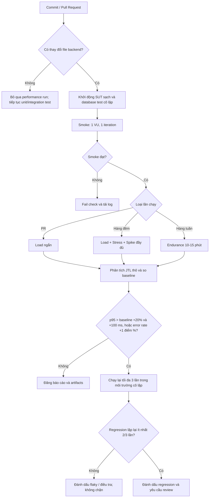

# Đề xuất kiểm thử hiệu năng liên tục

## Mô hình vận hành

- Pull Request: smoke và Load ngắn để phản hồi nhanh.
- Hàng đêm: chạy đầy đủ Load, Stress và Spike với fixture mới.
- Hàng tuần: Endurance tại 70% mức concurrency cao nhất đã duy trì ổn định.
- Lưu cùng nhau JTL thô, báo cáo HTML, phiên bản JMeter, commit SUT, phiên bản fixture và bằng chứng monitor tài nguyên.
- So sánh theo label và kịch bản ổn định. Tách assertion lỗi nghiệp vụ đã biết khỏi lỗi transport/HTTP.

## Đánh đổi

Runner self-hosted tốn thêm thời gian khi chạy Stress, Spike và Endurance. Runner local giảm chi phí cloud nhưng chịu nhiễu CPU, memory, tiến trình nền và trạng thái database. Database SQLite sạch giúp lặp lại tốt hơn nhưng có thể khác dữ liệu production. Ngưỡng p95 có thể tạo cảnh báo sai khi số mẫu nhỏ, vì vậy pipeline chạy lại và yêu cầu tái hiện trong 2/3 lần. Lưu JTL và HTML giúp audit nhưng tốn dung lượng; giữ đầy đủ artifact khi fail và rút ngắn thời gian lưu khi nightly pass. Baseline phải được version cùng tham số tải, nếu không thay đổi workload có thể bị hiểu nhầm là regression.
