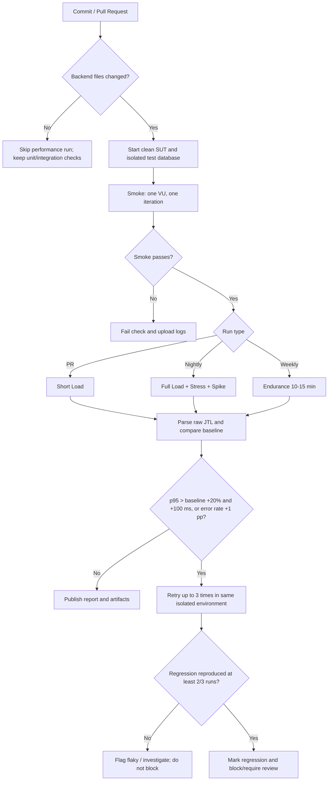

# Continuous Performance Testing proposal

## Operating model

- PR: smoke and short Load to give fast feedback.
- Nightly: full Load, Stress and Spike with fresh fixtures.
- Weekly: Endurance at 70% of the highest concurrency that remained stable.
- Store raw JTL, HTML report, JMeter version, SUT commit, fixture version and resource-monitor evidence together.
- Compare by stable label and scenario. Treat known business-gap assertions separately from transport/HTTP errors.

## Trade-offs

Self-hosted runner cost and runtime increase with Stress, Spike and Endurance. A local runner reduces cloud cost but adds CPU, memory, background-process and database-state noise. Fresh SQLite state improves repeatability but may differ from production data volume. A p95 threshold can create false positives when sample count is small, so the pipeline retries and requires reproduction in two of three runs. Retaining JTL and HTML artifacts improves auditability but consumes storage; retain full artifacts for failures and a shorter window for passing nightly runs. Baselines must be versioned with scenario parameters, otherwise a workload change can look like a product regression.

